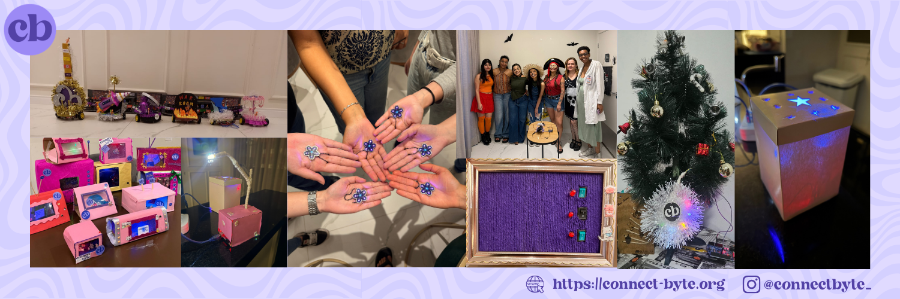

🇺🇸 English | 🇧🇷 [Português](#português)

  

# Connect Byte Projects

Hands-on projects developed in Connect Byte workshops.

This repository gathers practical technology projects created and explored during Connect Byte events. The projects combine hardware, software and creative technology to provide beginner-friendly and hands-on learning experiences.

Each project in this repository is designed to be:

- accessible for beginners
- practical and experiment-driven
- easy to reproduce
- open for exploration and improvement

The goal is to encourage learning through building real systems that combine physical components and software.

---

## How this repository works

Projects are organized into individual folders, each containing everything needed to reproduce the project:

- project documentation
- [WIP] circuit diagrams
- materials list
- source code
- examples or photos

These projects were originally created as part of Connect Byte workshops, where participants build and experiment with technology in a collaborative environment.

Anyone is welcome to explore the projects, build them and adapt them to create new ideas.

---

## About the community

The projects in this repository were originally created during **Connect Byte monthly workshops**.

These in-person workshops are designed for **women who want to explore technology through hands-on experiences**, whether they are beginners, simply curious about technology, not from a technical background, or already working in the field.

During the workshops participants collaborate to build practical projects combining hardware, software and creative technologies.

Spots are limited to keep the experience collaborative and hands-on, and they tend to fill up quickly.

---

## How to participate

If you would like to participate in one of the workshops, you can apply through our website.

Upcoming events and registrations are available at:

https://connect-byte.org

---

## Follow the community

You can follow Connect Byte and stay updated about upcoming workshops and projects through our social media:

- Website: https://connect-byte.org  
- Instagram: [@connectbyte_](https://www.instagram.com/connectbyte_)
- LinkedIn: [Connect Byte](https://www.linkedin.com/company/connect-byte/)

---

# Português

🇺🇸 [English](#connect-byte-projects) | 🇧🇷 Português

## Projetos da Connect Byte

Projetos práticos desenvolvidos nos workshops da Connect Byte.

Este repositório reúne projetos de tecnologia criados e explorados durante os encontros da comunidade Connect Byte. Os projetos combinam hardware, software e tecnologia criativa para proporcionar experiências de aprendizado práticas e acessíveis para iniciantes.

Cada projeto neste repositório é pensado para ser:

- acessível para iniciantes
- prático e baseado em experimentação
- fácil de reproduzir
- aberto para exploração e melhorias

O objetivo é incentivar o aprendizado através da construção de sistemas reais que combinam componentes físicos e software.

---

## Como este repositório funciona

Os projetos estão organizados em pastas individuais, cada uma contendo tudo o que é necessário para reproduzir o projeto:

- documentação do projeto
- [WIP] diagramas de circuito
- lista de materiais
- código-fonte
- exemplos ou fotos

Esses projetos foram originalmente criados como parte dos workshops da Connect Byte, onde as participantes constroem e experimentam tecnologia em um ambiente colaborativo.

Qualquer pessoa pode explorar os projetos, reproduzi-los e adaptá-los para criar novas ideias.

---

## Sobre a comunidade

Os projetos deste repositório foram originalmente criados durante os **encontros mensais da Connect Byte**.

Esses encontros presenciais são pensados para **mulheres que querem explorar tecnologia através de experiências práticas**, sejam iniciantes, apenas curiosas sobre tecnologia, não sejam da área ou já tenham experiência no campo. Não é necessário ter experiência prévia em tecnologia.

Durante os encontros as participantes colaboram para construir projetos que combinam hardware, software e tecnologias criativas.

As vagas são limitadas para manter a experiência colaborativa e prática, e costumam se esgotar rapidamente.

---

## Como participar

Se você gostaria de participar de um dos encontros, é possível se inscrever através do nosso site.

Os próximos eventos e inscrições estão disponíveis em:

https://connect-byte.org

---

## Acompanhe a comunidade

Você também pode acompanhar a Connect Byte e ficar por dentro dos próximos encontros e projetos através das redes sociais:

- Website: https://connect-byte.org  
- Instagram: [@connectbyte_](https://www.instagram.com/connectbyte_)
- LinkedIn: [Connect Byte](https://www.linkedin.com/company/connect-byte/)
