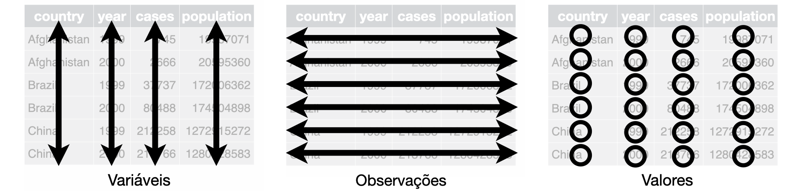
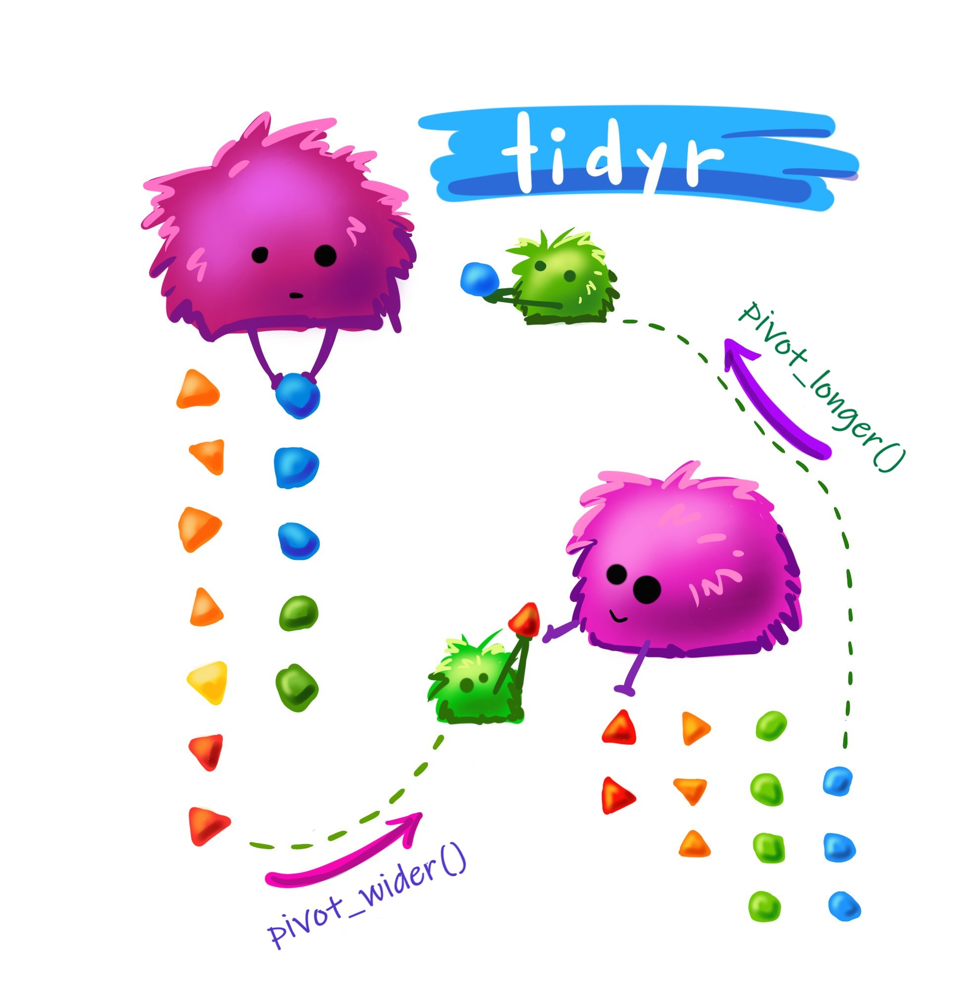
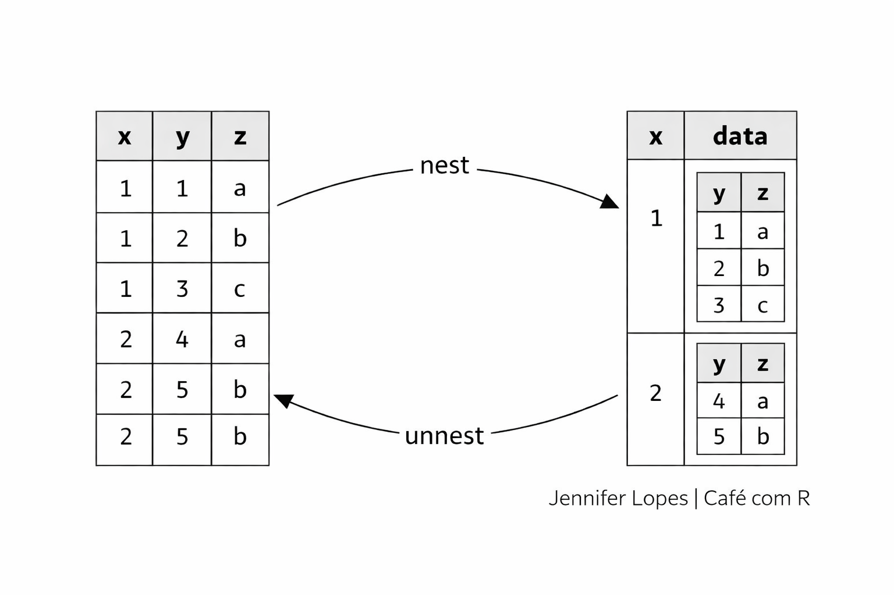

## Pergunta para você

> Se você precisar fazer uma análise exploratória completa com código, relatório de resultados e tudo mais ....
>
> **`Você saberia por onde começar? Quais análises escolher?`**

::: callout-tip
Com a minha experiência, trouxe algumas opções de análises que utilizo no dia a dia. Existem outras, mas a aula já ficou extensa e densa, e com essas já temos um ótimo ponto de partida.

**`Ótimos estudos, a aula foi construída com carinho, aproveite muito!`**
:::

## Objetivos da apresentação

::: incremental
-   Compreender os princípios de Tidy Data
-   Aplicar transformações com pivot_longer e pivot_wider
-   Utilizar nest e unnest para dados hierárquicos
-   Implementar workflow exploratório sistemático
-   Dominar ferramentas de EDA: DataExplorer, skimr, naniar
:::

## Conjunto de dados

Utilizaremos o dataset [**Coffee Ratings**](https://github.com/rfordatascience/tidytuesday/blob/main/data/2020/2020-07-07/readme.md) do TidyTuesday:

-   Avaliações de qualidade de café de diferentes países
-   Variáveis sensoriais: aroma, sabor, acidez, corpo
-   dados de origem, processamento e pontuação final
-   Ideal para demonstrar técnicas de organização e exploração

## Conjunto de dados

{fig-align="center" width="338"}

::: callout-note
## Fonte - Clique no link:

[**TidyTuesday - Coffee Quality Institute Database**](https://github.com/rfordatascience/tidytuesday/blob/main/data/2020/2020-07-07/readme.md)
:::

# Configuração inicial

## Carregar pacotes

```{r}
#| echo: true
#| message: false
#| warning: false
#| eval: false

# Instalar pacotes se necessário
if (!require("pacman")) install.packages("pacman")

pacman::p_load(
  tidyverse,      # Manipulação e visualização
  DT,             # Tabelas interativas
  DataExplorer,   # Exploração automatizada
  skimr,          # Resumos estatísticos
  naniar,         # Análise de dados ausentes
  scales,         # Formatação de escalas
  knitr,          # Geração de relatórios
  here)           # Gerenciamento de caminhos

```

## Importar dados - código

```{r}
#| echo: true
#| message: false
#| eval: false

# URL dos dados
url <- "https://raw.githubusercontent.com/rfordatascience/tidytuesday/refs/heads/main/data/2020/2020-07-07/coffee_ratings.csv"

# Importar
coffee <- read_csv(url)

# Visualizar estrutura básica
glimpse(coffee)
```

## Importar dados

```{r}
#| echo: false
#| message: false
#| warning: false

library(tidyverse)
library(DT)
library(DataExplorer)
library(skimr)
library(naniar)
library(scales)
library(knitr)

url <- "https://raw.githubusercontent.com/rfordatascience/tidytuesday/refs/heads/main/data/2020/2020-07-07/coffee_ratings.csv"
coffee <- read_csv(url)
glimpse(coffee)
```

::: notes
O dataset contém **1339 observações e 43 variáveis**. Inclui dados qualitativos (país, variedade) e quantitativos (pontuações sensoriais).
:::

## Primeiras linhas - código

```{r}
#| echo: true
#| eval: false

coffee %>%
  head(2) %>%
  DT::datatable(
    options = list(
      scrollX = TRUE,
      pageLength = 3,
      dom = 't'),
    rownames = FALSE)
```

## Primeiras linhas - resultado

```{r}
#| echo: false

coffee %>%
  head(2) %>%
  DT::datatable(
    options = list(
      scrollX = TRUE,
      pageLength = 3,
      dom = 't'),
    rownames = FALSE)
```

# Tidy Data Principles

[{fig-align="center"}](https://pt.r4ds.hadley.nz/data-tidy.html)

## O que é Tidy Data?

**dados organizados segundo três princípios fundamentais propostos por Hadley Wickham (2014):**

::: incremental
1.  **Cada variável forma uma coluna**: Cada coluna representa uma única variável medida
2.  **Cada observação forma uma linha**: Cada linha representa uma única unidade observacional
3.  **Cada tipo de unidade observacional forma uma tabela**: Diferentes níveis de análise ficam em tabelas separadas
:::

## Por que Tidy Data?

**Problema**: dados frequentemente vêm desorganizados, dificultando análises.

**Solução**: Padronização facilita:

-   Aplicação de funções vetorizadas
-   Integração com ferramentas tidyverse
-   Reutilização de código
-   Colaboração em equipe

## Vantagens dos dados organizados

::::: columns
::: {.column width="50%"}
**Consistência**

-   estrutura padronizada entre projetos
-   Reduz erros de manipulação
-   Facilita automação de processos

**Eficiência computacional**

-   Operações vetorizadas mais rápidas
-   Menos loops necessários
-   código mais limpo e legível
:::

::: {.column width="50%"}
**Compatibilidade**

-   Integração direta com ggplot2
-   Compatível com dplyr, tidyr
-   Facilita modelagem estatística

**Manutenibilidade**

-   código autoexplicativo
-   Documentação natural
-   Reprodutibilidade garantida
:::
:::::

## Selecionar variáveis relevantes - código

```{r}
#| echo: true
#| eval: false

coffee_selected <- coffee %>%
  select(
    country_of_origin,
    variety,
    processing_method,
    aroma,
    flavor,
    aftertaste,
    acidity,
    body,
    balance,
    total_cup_points)

# estrutura
str(coffee_selected)
```

## Selecionar variáveis relevantes - resultado

```{r}
#| echo: false

coffee_selected <- coffee %>%
  select(
    country_of_origin,
    variety,
    processing_method,
    aroma,
    flavor,
    aftertaste,
    acidity,
    body,
    balance,
    total_cup_points)

str(coffee_selected)
```

::: notes
**O dataset já está majoritariamente em formato tidy. Demonstraremos transformações comuns em análises reais.**
:::

# Transformações: pivot_longer

{fig-align="center" width="288"}

## Quando usar pivot_longer

**Cenário**: Múltiplas colunas representam valores de uma mesma variável.

**Exemplo:**

-   dados de vendas com colunas para cada mês (Jan, Fev, Mar...)
-   Atributos sensoriais tratados como colunas separadas
-   Medições repetidas em momentos diferentes

**Objetivo**: Converter formato wide (largo) para long (longo) para análises e visualizações mais eficientes.

## Por que transformar para long?

::: incremental
-   **Visualização**: ggplot2 funciona melhor com dados long
-   **Análise por grupos**: Facilita agrupamentos e sumarizações
-   **Modelagem**: Muitos modelos exigem formato long
-   **Comparações**: Permite comparar múltiplas categorias simultaneamente
:::

## pivot_longer - código

```{r}
#| echo: true
#| eval: false

# Transformar atributos sensoriais para formato long
coffee_long <- coffee_selected %>%
  pivot_longer(
    cols = c(aroma, flavor, aftertaste, acidity, body, balance),
    names_to = "atributo",
    values_to = "pontuacao")

# Visualizar primeiras linhas
coffee_long %>%
  head(2) %>%
  DT::datatable(
    options = list(scrollX = TRUE, pageLength = 3, dom = 't'),
    rownames = FALSE)
```

## pivot_longer - resultado

```{r}
#| echo: false

coffee_long <- coffee_selected %>%
  pivot_longer(
    cols = c(aroma, flavor, aftertaste, acidity, body, balance),
    names_to = "atributo",
    values_to = "pontuacao")

coffee_long %>%
  head(2) %>%
  DT::datatable(
    options = list(scrollX = TRUE, pageLength = 3, dom = 't'),
    rownames = FALSE)
```

## Estrutura resultante - código

```{r}
#| echo: true
#| eval: false

# Verificar dimensões
cat("Dimensões originais:", dim(coffee_selected), "\n")
cat("Dimensões após pivot_longer:", dim(coffee_long), "\n")

# Cada café agora tem 6 linhas (uma por atributo)
coffee_long %>%
  filter(country_of_origin == "Brazil") %>%
  slice(1:6) %>%
  select(country_of_origin, variety, atributo, pontuacao)
```

## Estrutura resultante - comparação

```{r}
#| echo: false

cat("Dimensões originais:", dim(coffee_selected), "\n")
cat("Dimensões após pivot_longer:", dim(coffee_long), "\n\n")

coffee_long %>%
  filter(country_of_origin == "Brazil") %>%
  slice(1:6) %>%
  select(country_of_origin, variety, atributo, pontuacao) %>%
  knitr::kable()
```

::: notes
A transformação aumentou o número de linhas de **1339 para 8034 (1339 × 6 atributos)**. Cada café agora aparece em **6 linhas, uma para cada atributo sensorial.**
:::

## Visualização com dados long - código

```{r}
#| echo: true
#| eval: false

# Paleta de cores do café
cores_cafe <- c("#6F4E37", "#8B4513", "#A0522D", 
                "#CD853F", "#DEB887", "#F5DEB3")

coffee_long %>%
  group_by(atributo) %>%
  summarise(media = mean(pontuacao, na.rm = TRUE)) %>%
  ggplot(aes(x = reorder(atributo, media), y = media, fill = atributo)) +
  geom_col(show.legend = FALSE) +
  scale_fill_manual(values = cores_cafe) +
  coord_flip() +
  labs(
    title = "Pontuação média por atributo sensorial",
    x = "Atributo",
    y = "Pontuação média",
    caption = "Jeni Lopes | Café com R.") +
  theme_classic(base_size = 14)
```

## Visualização com dados long - gráfico

```{r}
#| echo: false
#| fig-width: 10
#| fig-height: 6

cores_cafe <- c("#6F4E37", "#8B4513", "#A0522D", 
                "#CD853F", "#DEB887", "#F5DEB3")

coffee_long %>%
  group_by(atributo) %>%
  summarise(media = mean(pontuacao, na.rm = TRUE)) %>%
  ggplot(aes(x = reorder(atributo, media), y = media, fill = atributo)) +
  geom_col(show.legend = FALSE) +
  scale_fill_manual(values = cores_cafe) +
  coord_flip() +
  labs(
    title = "Pontuação média por atributo sensorial",
    x = "Atributo",
    y = "Pontuação média",
    caption = "Jeni Lopes | Café com R.") +
  theme_classic(base_size = 14)
```

# Transformações: pivot_wider

{fig-align="center" width="339"}

## Quando usar pivot_wider

**Cenário**: Valores estão empilhados e precisam ser distribuídos em colunas.

**Exemplo:**

-   Converter resultados long para tabelas de apresentação
-   Criar matriz de comparação entre grupos
-   Preparar dados para análise de correlação

**Objetivo**: Converter formato long (longo) para wide (largo).

## Por que transformar para wide?

::: incremental
-   **Apresentação**: Tabelas resumo são mais legíveis em formato wide
-   **Correlações**: Matrizes de correlação exigem formato wide
-   **Compatibilidade**: Alguns pacotes esperam dados wide
-   **Leitura**: Facilita comparações visuais rápidas
:::

## pivot_wider - código

```{r}
#| echo: true
#| eval: false

# Retornar ao formato original
coffee_wide <- coffee_long %>%
  pivot_wider(
    names_from = atributo,
    values_from = pontuacao)

# Verificar primeiras linhas
coffee_wide %>%
  head(2) %>%
  DT::datatable(
    options = list(scrollX = TRUE, pageLength = 3, dom = 't'),
    rownames = FALSE)
```

## pivot_wider - resultado

```{r}
#| echo: false

coffee_wide <- coffee_long %>%
  pivot_wider(
    names_from = atributo,
    values_from = pontuacao)

coffee_wide %>%
  head(2) %>%
  DT::datatable(
    options = list(scrollX = TRUE, pageLength = 3, dom = 't'),
    rownames = FALSE)
```

## Criar tabela de resumo wide - código

```{r}
#| echo: true
#| eval: false

# Resumo por país e atributo
resumo_pais <- coffee_long %>%
  group_by(country_of_origin, atributo) %>%
  summarise(media = mean(pontuacao, na.rm = TRUE), .groups = "drop") %>%
  pivot_wider(
    names_from = atributo,
    values_from = media)

# Top 5 países
resumo_pais %>%
  head(5) %>%
  DT::datatable(
    options = list(scrollX = TRUE, pageLength = 5, dom = 't'),
    rownames = FALSE) %>%
  DT::formatRound(columns = 2:7, digits = 2)
```

## Criar tabela de resumo wide - resultado

```{r}
#| echo: false

resumo_pais <- coffee_long %>%
  group_by(country_of_origin, atributo) %>%
  summarise(media = mean(pontuacao, na.rm = TRUE), .groups = "drop") %>%
  pivot_wider(
    names_from = atributo,
    values_from = media)

resumo_pais %>%
  head(2) %>%
  DT::datatable(
    options = list(scrollX = TRUE, pageLength = 5, dom = 't'),
    rownames = FALSE) %>%
  DT::formatRound(columns = 2:7, digits = 2)
```

::: notes
O formato wide é útil para tabelas de apresentação e comparações rápidas entre categorias. Cada país agora tem todas suas médias em uma única linha.
:::

# Transformações: nest e unnest

{fig-align="center" width="412"}

## Quando usar nest

**Conceito**: List-columns permitem armazenar dataframes dentro de dataframes.

**Cenário**:

-   Agrupar dados relacionados hierarquicamente
-   Aplicar modelos diferentes para cada grupo
-   Manter contexto de agrupamento durante operações complexas

**Objetivo**: Criar estruturas hierárquicas com list-columns.

## Por que usar dados aninhados?

::: incremental
-   **Organização**: Mantém dados relacionados juntos
-   **Operações em Grupo**: Aplica funções complexas por grupo
-   **Modelagem**: Ajusta modelos separados por categoria
-   **Eficiência**: Evita múltiplos dataframes soltos
:::

## nest - código

```{r}
#| echo: true
#| eval: false

# Aninhar dados por país
coffee_nested <- coffee_selected %>%
  group_by(country_of_origin) %>%
  nest()

# Visualizar estrutura
coffee_nested %>%
  head(2) %>%
  DT::datatable(
    options = list(scrollX = TRUE, pageLength = 3, dom = 't'),
    rownames = FALSE)
```

## nest - resultado

```{r}
#| echo: false

coffee_nested <- coffee_selected %>%
  group_by(country_of_origin) %>%
  nest()

coffee_nested %>%
  head(2) %>%
  DT::datatable(
    options = list(scrollX = TRUE, pageLength = 3, dom = 't'),
    rownames = FALSE)
```

## Estrutura dos dados aninhados - código

```{r}
#| echo: true
#| eval: false

# Verificar estrutura
str(coffee_nested, max.level = 2)

# Acessar dados de um país específico
coffee_nested %>%
  filter(country_of_origin == "Ethiopia") %>%
  pull(data) %>%
  .[[1]] %>%
  head(2)
```

## Eestrutura dos dados aninhados - resultado

```{r}
#| echo: false

str(coffee_nested, max.level = 2)
```

## Acessar dados do país específico

```{r}
#| echo: false

coffee_nested %>%
  filter(country_of_origin == "Ethiopia") %>%
  pull(data) %>%
  .[[1]] %>%
  head(2) %>%
  knitr::kable()
```

::: notes
Cada linha contém um dataframe completo com todas as avaliações daquele país. A coluna "data" é uma list-column.
:::

## Operações com dados aninhados - código

```{r}
#| echo: true
#| eval: false

# Calcular estatísticas por país usando map
library(purrr)

coffee_stats <- coffee_nested %>%
  mutate(
    n_avaliacoes = map_int(data, nrow),
    media_total = map_dbl(data, ~mean(.x$total_cup_points, na.rm = TRUE)),
    sd_total = map_dbl(data, ~sd(.x$total_cup_points, na.rm = TRUE)))

# Visualizar
coffee_stats %>%
  select(-data) %>%
  arrange(desc(media_total)) %>%
  head(5)
```

## Operações com dados aninhados - resultado

```{r}
#| echo: false

library(purrr)

coffee_stats <- coffee_nested %>%
  mutate(
    n_avaliacoes = map_int(data, nrow),
    media_total = map_dbl(data, ~mean(.x$total_cup_points, na.rm = TRUE)),
    sd_total = map_dbl(data, ~sd(.x$total_cup_points, na.rm = TRUE)))

coffee_stats %>%
  select(-data) %>%
  arrange(desc(media_total)) %>%
  head(5) %>%
  DT::datatable(
    options = list(scrollX = TRUE, pageLength = 5, dom = 't'),
    rownames = FALSE) %>%
  DT::formatRound(columns = 2:4, digits = 2)
```

## Quando usar unnest

**Conceito**: Expandir dados aninhados de volta ao formato tabular.

**Cenário**:

-   Retornar à estrutura original após operações
-   Preparar dados para análises convencionais
-   Combinar resultados de múltiplos grupos

**Objetivo**: Desfazer o aninhamento para análises tabulares.

## unnest - código

```{r}
#| echo: true
#| eval: false

# Desaninhar dados
coffee_unnested <- coffee_nested %>%
  unnest(data)

# Verificar se retornou ao formato original
identical(
  coffee_selected %>% arrange(country_of_origin),
  coffee_unnested %>% arrange(country_of_origin))

# Dimensões
dim(coffee_unnested)
```

## unnest - resultado

```{r}
#| echo: false

coffee_unnested <- coffee_nested %>%
  unnest(data)

cat("dados são idênticos ao original?", 
    identical(
      coffee_selected %>% arrange(country_of_origin),
      coffee_unnested %>% arrange(country_of_origin)),"\n\n")

cat("Dimensões após unnest:", dim(coffee_unnested))
```

::: notes
**unnest** reverte a operação de **nest**, expandindo os dataframes aninhados de volta para linhas individuais. Útil após realizar operações complexas com list-columns.
:::

# Workflow de uma EDA

## Estrutura do processo exploratório

1.  Importação de dados
2.  Inspeção inicial
3.  Verificar tipos de dados
4.  Analisar dados ausentes
5.  Estatísticas descritivas
6.  Visualizações univariadas
7.  Análises bivariadas
8.  Identificar padrões
9.  Documentar resultados

## O que é EDA?

**Exploratory Data Analysis (EDA)** é o processo sistemático de investigar dados para:

-   Descobrir padrões e relações
-   Detectar anomalias e outliers
-   Testar hipóteses iniciais
-   Verificar pressupostos estatísticos
-   Guiar modelagem posterior

**Origem**: Proposta por John Tukey (1977) como filosofia de análise de dados.

## Princípios do workflow EDA

::: incremental
1.  **Sistematização**: Seguir sequência consistente e documentada
2.  **Ceticismo**: Questionar resultados e verificar suposições
3.  **Visualização**: Combinar números e gráficos
4.  **Iteração**: Revisitar etapas conforme necessário
5.  **Documentação**: Registrar descobertas e decisões
:::

## Por que EDA é fundamental?

::::: columns
::: {.column width="50%"}
**Antes da modelagem**

-   Identificar problemas de qualidade
-   Entender distribuições
-   Detectar multicolinearidade
-   Selecionar features relevantes
:::

::: {.column width="50%"}
**Durante o projeto**

-   Validar transformações
-   Verificar pressupostos
-   Guiar decisões técnicas
-   Comunicar com stakeholders
:::
:::::

# Inspeção inicial

## Dimensões e estrutura - código

```{r}
#| echo: true
#| eval: false

# Dimensões
dim(coffee)

# estrutura compacta
str(coffee, give.attr = FALSE)
```

## Dimensões e estrutura - resultado

```{r}
#| echo: false

dim(coffee)
str(coffee, give.attr = FALSE)
```

## Nomes das variáveis - código

```{r}
#| echo: true
#| eval: false

# Listar todas as variáveis
names(coffee)
```

## Nomes das variáveis - resultado

```{r}
#| echo: false

names(coffee)
```

## Tipos de dados - código

```{r}
#| echo: true
#| eval: false

# Verificar tipos
coffee %>%
  summarise(across(everything(), class)) %>%
  pivot_longer(
    cols = everything(),
    names_to = "variavel",
    values_to = "tipo") %>%
  head(5)
```

## Tipos de dados - resultado

```{r}
#| echo: false

coffee %>%
  summarise(across(everything(), class)) %>%
  pivot_longer(
    cols = everything(),
    names_to = "variavel",
    values_to = "tipo") %>%
  head(5) %>%
  DT::datatable(
    options = list(scrollX = TRUE, pageLength = 5, dom = 't'),
    rownames = FALSE)
```

::: notes
Identificar tipos incorretos é crucial. Variáveis categóricas como character devem ser convertidas para factor quando apropriado para análises e visualizações.
:::

# DataExplorer: exploração automatizada

[{fig-align="center" width="231"}](https://boxuancui.github.io/DataExplorer/)

## O que é DataExplorer?

**DataExplorer** é um [pacote para EDA](https://boxuancui.github.io/DataExplorer/) automatizada que:

-   Gera relatórios HTML completos
-   Cria visualizações padronizadas
-   Identifica problemas de qualidade
-   Economiza tempo na fase exploratória

**Ideal para**: Obter visão panorâmica rápida dos dados.

## Visão geral - código

```{r}
#| echo: true
#| eval: false

# Relatório de estrutura
DataExplorer::introduce(coffee)
```

## Visão geral - resultado

```{r}
#| echo: false

DataExplorer::introduce(coffee)
```

## Visualização da estrutura - código

```{r}
#| echo: true
#| eval: false

# Gráfico de estrutura dos dados
DataExplorer::plot_intro(coffee)
```

## Visualização da estrutura - gráfico

```{r}
#| echo: false
#| fig-width: 10
#| fig-height: 6

DataExplorer::plot_intro(coffee)
```

::: notes
DataExplorer mostra: 43 colunas, 1339 linhas, 15 colunas discretas, 28 contínuas. Visualização rápida da composição do dataset.
:::

## Distribuição das variáveis numéricas - código

```{r}
#| echo: true
#| eval: false

# Visualizar distribuição de tipos
coffee %>%
  select(where(is.numeric)) %>%
  select(1:9) %>%  # Primeiras 9 variáveis numéricas
  DataExplorer::plot_histogram(
    ncol = 3,
    title = "Distribuição das variáveis numéricas.")
```

## Distribuição das variáveis numéricas - gráfico

```{r}
#| echo: false
#| fig-width: 10
#| fig-height: 7

coffee %>%
  select(where(is.numeric)) %>%
  select(1:9) %>%
  DataExplorer::plot_histogram(
    ncol = 3,
    title = "Distribuição das variáveis numéricas.")
```

## Análise de dados ausentes - código

```{r}
#| echo: true
#| eval: false

# Visualizar padrão de dados ausentes
DataExplorer::plot_missing(coffee)
```

## Análise de dados ausentes - gráfico

```{r}
#| echo: false
#| fig-width: 10
#| fig-height: 6

DataExplorer::plot_missing(coffee)
```

::: notes
Algumas variáveis apresentam alta proporção de dados ausentes: lot_number (63%), altitude (26%). Isso requer decisões sobre imputação ou exclusão na análise.
:::

## Correlações entre variáveis - código

```{r}
#| echo: true
#| eval: false

# Matriz de correlação (apenas variáveis numéricas)
coffee %>%
  select(
    aroma, flavor, aftertaste, acidity, 
    body, balance, uniformity, clean_cup,
    sweetness, total_cup_points) %>%
  DataExplorer::plot_correlation(
    title = "Correlações entre atributos sensoriais.")
```

## Correlações entre variáveis - gráfico

```{r}
#| echo: false
#| fig-width: 10
#| fig-height: 8

coffee %>%
  select(
    aroma, flavor, aftertaste, acidity, 
    body, balance, uniformity, clean_cup,
    sweetness, total_cup_points) %>%
  DataExplorer::plot_correlation(
    title = "Correlações entre atributos sensoriais.")
```

# skimr: Resumos estatísticos

[{fig-align="center" width="239"}](https://docs.ropensci.org/skimr/)

## O que é skimr?

[**skimr**](https://docs.ropensci.org/skimr/) fornece resumos estatísticos aprimorados que:

-   Organiza resultados por tipo de variável
-   Inclui histogramas inline (sparklines)
-   Mostra estatísticas específicas por tipo
-   Identifica dados ausentes por variável

**Vantagem**: Mais informativo que **`summary()`** base do R.

## Visão geral com skimr - código

```{r}
#| echo: true
#| eval: false

# Resumo completo
skim_result <- skimr::skim(coffee)

# Exibir resumo
skim_result
```

## Visão geral com skimr - resultado

```{r}
#| echo: false

skim_result <- skimr::skim(coffee)
skim_result
```

::: notes
skimr fornece estatísticas descritivas organizadas por tipo de variável, incluindo histogramas inline para rápida visualização de distribuições.
:::

## Resumo das variáveis numéricas - código

```{r}
#| echo: true
#| eval: false

# Focar em variáveis numéricas sensoriais
coffee %>%
  select(
    aroma, flavor, aftertaste, acidity, body, 
    balance, total_cup_points) %>%
  skimr::skim()
```

## Resumo das variáveis numéricas - resultado

```{r}
#| echo: false

coffee %>%
  select(
    aroma, flavor, aftertaste, acidity, body, 
    balance, total_cup_points) %>%
  skimr::skim()
```

## Resumo das variáveis categóricas - código

```{r}
#| echo: true
#| eval: false

# Focar em variáveis categóricas
coffee %>%
  select(
    country_of_origin, variety, processing_method, 
    color, species) %>%
  skimr::skim()
```

## Resumo das variáveis categóricas - resultado

```{r}
#| echo: false

coffee %>%
  select(
    country_of_origin, variety, processing_method, 
    color, species) %>%
  skimr::skim()
```

::: notes
Para variáveis categóricas, skimr mostra: valores únicos, categoria mais frequente, proporção de dados ausentes. Essencial para entender distribuição de categorias.
:::

## Estatísticas personalizadas - código

```{r}
#| echo: true
#| eval: false

# Criar função personalizada para CV (Coeficiente de Variação)
coffee %>%
  select(aroma, flavor, aftertaste, acidity, body, balance) %>%
  summarise(
    across(
      everything(),
      list(
        media = ~mean(., na.rm = TRUE),
        mediana = ~median(., na.rm = TRUE),
        cv = ~sd(., na.rm = TRUE) / mean(., na.rm = TRUE)))) %>%
  pivot_longer(
    cols = everything(),
    names_to = c("variavel", "estatistica"),
    names_sep = "_") %>%
  pivot_wider(
    names_from = estatistica,
    values_from = value)
```

## Estatísticas personalizadas - resultado

```{r}
#| echo: false

coffee %>%
  select(aroma, flavor, aftertaste, acidity, body, balance) %>%
  summarise(
    across(
      everything(),
      list(
        media = ~mean(., na.rm = TRUE),
        mediana = ~median(., na.rm = TRUE),
        cv = ~sd(., na.rm = TRUE) / mean(., na.rm = TRUE)))) %>%
  pivot_longer(
    cols = everything(),
    names_to = c("variavel", "estatistica"),
    names_sep = "_") %>%
  pivot_wider(
    names_from = estatistica,
    values_from = value) %>%
  DT::datatable(
    options = list(scrollX = TRUE, pageLength = 6, dom = 't'),
    rownames = FALSE) %>%
  DT::formatRound(columns = 2:4, digits = 3)
```

# naniar: análise de dados ausentes

[{fig-align="center" width="182"}](https://naniar.njtierney.com/)

## O que é naniar?

[**naniar**](https://naniar.njtierney.com/) é especializado em análise de dados ausentes (missing data):

-   Visualiza padrões de ausência
-   Calcula proporções por variável
-   Identifica se ausência é aleatória (MCAR, MAR, MNAR)
-   Facilita decisões sobre imputação

**Crucial**: dados ausentes podem viesar análises e modelos.

## Por que analisar dados ausentes?

::: incremental
-   **Viés**: Ausência não aleatória distorce resultados
-   **Perda de poder**: Reduz tamanho amostral efetivo
-   **Invalidação**: Pode violar pressupostos de modelos
-   **Decisão informada**: Guia estratégia de tratamento (imputar x excluir)
:::

## Tipos de dados ausentes

**MCAR** (Missing Completely At Random): Ausência independente de qualquer variável.

**MAR** (Missing At Random): Ausência relacionada a variáveis observadas.

**MNAR** (Missing Not At Random): Ausência relacionada ao próprio valor ausente.

## Proporção de dados ausentes - código

```{r}
#| echo: true
#| eval: false

# Resumo de dados ausentes
naniar::miss_var_summary(coffee) %>%
  head(15)
```

## Proporção de dados ausentes - resultado

```{r}
#| echo: false

naniar::miss_var_summary(coffee) %>%
  head(15) %>%
  DT::datatable(
    options = list(scrollX = TRUE, pageLength = 15, dom = 't'),
    rownames = FALSE) %>%
  DT::formatRound(columns = 3, digits = 2)
```

## Visualização de padrões ausentes - código

```{r}
#| echo: true
#| eval: false

# Gráfico de dados ausentes em variáveis chave
coffee %>%
  select(
    country_of_origin, variety, lot_number, 
    altitude_mean_meters, aroma, flavor, 
    total_cup_points) %>%
  naniar::vis_miss()
```

## Visualização de padrões ausentes - gráfico

```{r}
#| echo: false
#| fig-width: 10
#| fig-height: 6

coffee %>%
  select(
    country_of_origin, variety, lot_number, 
    altitude_mean_meters, aroma, flavor, 
    total_cup_points) %>%
  naniar::vis_miss()
```

::: notes
A visualização mostra que lot_number tem muitos dados ausentes (63%), altitude_mean_meters também (26%). Não há padrão sistemático óbvio de ausência.
:::

## Análise de ausência por categoria - código

```{r}
#| echo: true
#| eval: false

# dados ausentes de altitude por país
coffee %>%
  group_by(country_of_origin) %>%
  naniar::miss_var_summary() %>%
  filter(variable == "altitude_mean_meters") %>%
  arrange(desc(pct_miss)) %>%
  head(10) %>%
  ggplot(aes(x = reorder(country_of_origin, pct_miss), 
             y = pct_miss)) +
  geom_col(fill = "#8B4513") +
  coord_flip() +
  labs(
    title = "Proporção de dados ausentes de altitude por país.",
    x = "País",
    y = "Percentual Ausente (%)", 
    caption = "Jennifer Lopes | Café com R.") +
  theme_classic(base_size = 12)
```

## Análise de ausência por categoria - gráfico

```{r}
#| echo: false
#| fig-width: 10
#| fig-height: 6

coffee %>%
  group_by(country_of_origin) %>%
  naniar::miss_var_summary() %>%
  filter(variable == "altitude_mean_meters") %>%
  arrange(desc(pct_miss)) %>%
  head(10) %>%
  ggplot(aes(x = reorder(country_of_origin, pct_miss), 
             y = pct_miss)) +
  geom_col(fill = "#8B4513") +
  coord_flip() +
  labs(
    title = "Proporção de dados ausentes de altitude por país.",
    x = "País",
    y = "Percentual Ausente (%)", 
    caption = "Jennifer Lopes | Café com R.") +
  theme_classic(base_size = 12)
```

## Estratégias de tratamento (cada caso é um, cuidado)

**Quando excluir (cuidado):**

-   Ausência \< 5% e MCAR
-   Variável não essencial para análise

**Quando imputar (cuidado):**

-   Ausência 5-40% e MAR
-   Variável importante para modelo
-   dados ausentes têm padrão explicável

**Métodos de imputação**: Média/mediana, regressão, KNN, MICE.

## Imputação simples - código

```{r}
#| echo: true
#| eval: false

# Estratégias comuns de tratamento
coffee_treated <- coffee %>%
  mutate(
    # Imputar altitude com mediana global
    altitude_filled = ifelse(
      is.na(altitude_mean_meters),
      median(altitude_mean_meters, na.rm = TRUE),
      altitude_mean_meters),
    # Criar flag de ausência (importante!)
    altitude_missing = is.na(altitude_mean_meters))

# Verificar
coffee_treated %>%
  select(country_of_origin, altitude_mean_meters, 
         altitude_filled, altitude_missing) %>%
  head(3)
```

## Imputação simples - resultado

```{r}
#| echo: false

coffee_treated <- coffee %>%
  mutate(
    altitude_filled = ifelse(
      is.na(altitude_mean_meters),
      median(altitude_mean_meters, na.rm = TRUE),
      altitude_mean_meters),
    altitude_missing = is.na(altitude_mean_meters))

coffee_treated %>%
  select(country_of_origin, altitude_mean_meters, 
         altitude_filled, altitude_missing) %>%
  head(3) %>%
  DT::datatable(
    options = list(scrollX = TRUE, pageLength = 3, dom = 't'),
    rownames = FALSE)
```

::: notes
Flag de ausência preserva informação sobre onde havia dados faltantes. Útil para verificar se ausência em si é preditiva.
:::

# Análises univariadas

## O que são análises univariadas?

**Definição**: Análise de uma variável por vez, sem considerar relações.

**Objetivo**:

-   Entender distribuição de cada variável
-   Verificar normalidade e simetria
-   Detectar problemas de qualidade

**Por que fazer**: Base para análises mais complexas.

## Por que análise univariada?

::: incremental
-   **Detectar problemas**: Outliers, erros de digitação, valores impossíveis
-   **Entender dados**: Forma da distribuição, centro, dispersão
-   **Guiar transformações**: Decidir se precisa normalizar, logaritmar
-   **Comunicar**: Gráficos simples para stakeholders
:::

## Distribuição da pontuação total - código

```{r}
#| echo: true
#| eval: false

coffee %>%
  ggplot(aes(x = total_cup_points)) +
  geom_histogram(bins = 30, fill = "#6F4E37", alpha = 0.8) +
  geom_vline(
    aes(xintercept = mean(total_cup_points, na.rm = TRUE)),
    color = "#CD853F", linetype = "dashed", size = 1) +
  labs(
    title = "Distribuição da pontuação total.",
    subtitle = "Linha tracejada indica a média.",
    x = "Pontuação Total",
    y = "Frequência", 
    caption = "Jennifer Lopes | Café com R.") +
  theme_classic(base_size = 14)
```

## Distribuição da pontuação total - gráfico

```{r}
#| echo: false
#| fig-width: 10
#| fig-height: 5

coffee %>%
  ggplot(aes(x = total_cup_points)) +
  geom_histogram(bins = 30, fill = "#6F4E37", alpha = 0.8) +
  geom_vline(
    aes(xintercept = mean(total_cup_points, na.rm = TRUE)),
    color = "#CD853F", linetype = "dashed", size = 1) +
  labs(
    title = "Distribuição da pontuação total.",
    subtitle = "Linha tracejada indica a média.",
    x = "Pontuação Total",
    y = "Frequência", 
    caption = "Jennifer Lopes | Café com R.") +
  theme_classic(base_size = 14)
```

::: notes
Distribuição aproximadamente normal, levemente assimétrica à esquerda. Média de 82.1 pontos. Maioria dos cafés concentra-se entre 80-84 pontos.
:::

## Densidade por atributo - código

```{r}
#| echo: true
#| eval: false

coffee_long %>%
  ggplot(aes(x = pontuacao, fill = atributo)) +
  geom_density(alpha = 0.6) +
  scale_fill_manual(values = cores_cafe) +
  labs(
    title = "Densidade de pontuações por atributo sensorial.",
    x = "Pontuação",
    y = "Densidade",
    fill = "Atributo", 
    caption = "Jennifer Lopes | Café com R.") +
  theme_classic(base_size = 12)
```

## Densidade por atributo - gráfico

```{r}
#| echo: false
#| fig-width: 10
#| fig-height: 6

coffee_long %>%
  ggplot(aes(x = pontuacao, fill = atributo)) +
  geom_density(alpha = 0.6) +
  scale_fill_manual(values = cores_cafe) +
  labs(
    title = "Densidade de pontuações por atributo sensorial.",
    x = "Pontuação",
    y = "Densidade",
    fill = "Atributo", 
    caption = "Jennifer Lopes | Café com R.") +
  theme_classic(base_size = 12)
```

## Boxplot de atributos - código

```{r}
#| echo: true
#| eval: false

coffee_long %>%
  ggplot(aes(x = atributo, y = pontuacao, fill = atributo)) +
  geom_boxplot(show.legend = FALSE) +
  scale_fill_manual(values = cores_cafe) +
  labs(
    title = "Distribuição de pontuações por atributo.",
    x = "Atributo",
    y = "Pontuação",
    caption = "Jennifer Lopes | Café com R.") +
  theme_classic(base_size = 12) +
  theme(axis.text.x = element_text(angle = 45, hjust = 1))
```

## Boxplot de atributos - gráfico

```{r}
#| echo: false
#| fig-width: 10
#| fig-height: 6

coffee_long %>%
  ggplot(aes(x = atributo, y = pontuacao, fill = atributo)) +
  geom_boxplot(show.legend = FALSE) +
  scale_fill_manual(values = cores_cafe) +
  labs(
    title = "Distribuição de pontuações por atributo.",
    x = "Atributo",
    y = "Pontuação",
    caption = "Jennifer Lopes | Café com R.") +
  theme_classic(base_size = 12) +
  theme(axis.text.x = element_text(angle = 45, hjust = 1))
```

::: notes
Balance e body apresentam distribuições mais concentradas (menor variabilidade). Acidity mostra maior variabilidade e alguns outliers inferiores.
:::

## Países produtores - código

```{r}
#| echo: true
#| eval: false

coffee %>%
  count(country_of_origin, sort = TRUE) %>%
  head(15) %>%
  ggplot(aes(x = reorder(country_of_origin, n), y = n)) +
  geom_col(fill = "#8B4513") +
  coord_flip() +
  labs(
    title = "Os 15 Países que mais produziram - por número de avaliações.",
    x = "País",
    y = "Número de avaliações", 
    caption = "Jennifer Lopes | Café com R.") +
  theme_classic(base_size = 12)
```

## Países produtores - gráfico

```{r}
#| echo: false
#| fig-width: 10
#| fig-height: 6

coffee %>%
  count(country_of_origin, sort = TRUE) %>%
  head(15) %>%
  ggplot(aes(x = reorder(country_of_origin, n), y = n)) +
  geom_col(fill = "#8B4513") +
  coord_flip() +
  labs(
    title = "Os 15 Países que mais produziram - por número de avaliações.",
    x = "País",
    y = "Número de avaliações", 
    caption = "Jennifer Lopes | Café com R.") +
  theme_classic(base_size = 12)
```

# Análises bivariadas

## O que são Análises bivariadas?

**Definição**: Análise da relação entre duas variáveis.

**Objetivo**:

-   Identificar correlações e associações
-   Entender como variáveis se relacionam
-   Detectar tendências e padrões conjuntos
-   Gerar hipóteses sobre causalidade

**Tipos**: Numérica-numérica, categórica-numérica, categórica-categórica.

## Por que Análise bivariada?

::: incremental
-   **Relações**: Descobrir como variáveis interagem
-   **Predição**: Identificar preditores potenciais
-   **Segmentação**: Encontrar diferenças entre grupos
-   **Negócio**: Responder perguntas práticas
:::

## Pontuação por país - código

```{r}
#| echo: true
#| eval: false

coffee %>%
  group_by(country_of_origin) %>%
  summarise(
    media = mean(total_cup_points, na.rm = TRUE),
    n = n()) %>%
  filter(n >= 10) %>%  
  arrange(desc(media)) %>%
  head(10) %>%
  ggplot(aes(x = reorder(country_of_origin, media), y = media)) +
  geom_col(fill = "#A0522D") +
  geom_text(aes(label = round(media, 1)), hjust = -0.2, size = 3.5) +
  coord_flip() +
  labs(
    title = "Países com maior pontuação média.",
    subtitle = "Mínimo de 10 avaliações.",
    x = "País",
    y = "Pontuação Média",
    caption = "Jennifer Lopes | Café com R.") +
  theme_classic(base_size = 12)
```

## Pontuação por país - gráfico

```{r}
#| echo: false
#| fig-width: 10
#| fig-height: 6

coffee %>%
  group_by(country_of_origin) %>%
  summarise(
    media = mean(total_cup_points, na.rm = TRUE),
    n = n()
  ) %>%
  filter(n >= 10) %>%
  arrange(desc(media)) %>%
  head(10) %>%
  ggplot(aes(x = reorder(country_of_origin, media), y = media)) +
  geom_col(fill = "#A0522D") +
  geom_text(aes(label = round(media, 1)), hjust = -0.2, size = 3.5) +
  coord_flip() +
  labs(
    title = "Países com maior pontuação média.",
    subtitle = "Mínimo de 10 avaliações.",
    x = "País",
    y = "Pontuação Média",
    caption = "Jennifer Lopes | Café com R.") +
  ylim(0, 88) +
  theme_classic(base_size = 12)
```

::: notes
Etiópia lidera com 85.5 pontos, seguida por Quênia. Filtro de mínimo 10 avaliações evita viés de países com poucas amostras.
:::

## Relação altitude x pontuação - código

```{r}
#| echo: true
#| eval: false

coffee %>%
  filter(!is.na(altitude_mean_meters)) %>%
  ggplot(aes(x = altitude_mean_meters, y = total_cup_points)) +
  geom_point(alpha = 0.4, color = "#6F4E37") +
  geom_smooth(method = "lm", color = "#CD853F", se = TRUE) +
  labs(
    title = "Relação entre altitude e pontuação total.",
    subtitle = "Linha de regressão linear com intervalo de confiança.",
    x = "Altitude Média (metros)",
    y = "Pontuação Total",
    caption = "Jennifer Lopes | Café com R.") +
  theme_classic(base_size = 14)
```

## Relação altitude x pontuação - gráfico

```{r}
#| echo: false
#| fig-width: 10
#| fig-height: 5

coffee %>%
  filter(!is.na(altitude_mean_meters)) %>%
  ggplot(aes(x = altitude_mean_meters, y = total_cup_points)) +
  geom_point(alpha = 0.4, color = "#6F4E37") +
  geom_smooth(method = "lm", color = "#CD853F", se = TRUE) +
  labs(
    title = "Relação entre altitude e pontuação total.",
    subtitle = "Linha de regressão linear com intervalo de confiança.",
    x = "Altitude Média (metros)",
    y = "Pontuação Total",
    caption = "Jennifer Lopes | Café com R.") +
  theme_classic(base_size = 14)
```

::: notes
Há correlação positiva fraca entre altitude e pontuação. Cafés cultivados em maior altitude tendem a ter melhor avaliação, mas relação não é forte (muita dispersão).
:::

## Interpretação: Altitude x Pontuação

**Correlação observada**: Positiva e fraca

**Explicações**:

-   Altitude afeta maturação dos grãos (mais lenta = mais sabor)
-   Temperaturas mais frias em altitude elevada
-   Fatores confundidores: variedade, processamento, país

**Limitação**: Correlação ≠ Causalidade. Pode haver variáveis omitidas.

## Comparação entre métodos de processamento - código

```{r}
#| echo: true
#| eval: false

coffee %>%
  filter(!is.na(processing_method)) %>%
  group_by(processing_method) %>%
  filter(n() >= 20) %>% 
  ggplot(aes(x = processing_method, y = total_cup_points, 
             fill = processing_method)) +
  geom_violin(show.legend = FALSE, alpha = 0.7) +
  geom_boxplot(width = 0.2, show.legend = FALSE, alpha = 0.5) +
  scale_fill_manual(values = cores_cafe[1:5]) +
  labs(
    title = "Pontuação por método de processamento.",
    subtitle = "Métodos com pelo menos 20 avaliações.",
    x = "Método de Processamento",
    y = "Pontuação Total", 
    caption = "Jennifer Lopes | Café com R.") +
  theme_minimal(base_size = 12) +
  theme(axis.text.x = element_text(angle = 45, hjust = 1))
```

## Comparação entre métodos de processamento - gráfico

```{r}
#| echo: false
#| fig-width: 10
#| fig-height: 6

coffee %>%
  filter(!is.na(processing_method)) %>%
  group_by(processing_method) %>%
  filter(n() >= 20) %>%
  ggplot(aes(x = processing_method, y = total_cup_points, 
             fill = processing_method)) +
  geom_violin(show.legend = FALSE, alpha = 0.7) +
  geom_boxplot(width = 0.2, show.legend = FALSE, alpha = 0.5) +
  scale_fill_manual(values = cores_cafe[1:5]) +
  labs(
    title = "Pontuação por método de processamento.",
    subtitle = "Métodos com pelo menos 20 avaliações.",
    x = "Método de Processamento",
    y = "Pontuação Total", 
    caption = "Jennifer Lopes | Café com R.") +
  theme_minimal(base_size = 12) +
  theme(axis.text.x = element_text(angle = 45, hjust = 1))
```

::: notes
Processamento Washed (lavado) apresenta mediana similar ao Natural, mas menor variabilidade. Natural tem maior dispersão, com alguns cafés de pontuação muito alta.
:::

## Matriz de correlação - código

```{r}
#| echo: true
#| eval: false

library(corrplot)

# Calcular matriz de correlação
cor_matrix <- coffee %>%
  select(
    aroma, flavor, aftertaste, acidity, body, 
    balance, uniformity, clean_cup, sweetness) %>%
  cor(use = "complete.obs")

# Visualizar
corrplot(
  cor_matrix,
  method = "color",
  type = "upper",
  order = "hclust",
  tl.col = "black",
  tl.srt = 45,
  addCoef.col = "black",
  number.cex = 0.7,
  col = colorRampPalette(c("#F5DEB3", "#8B4513", "#3E2723"))(200),
  title = "Correlações entre atributos sensoriais.",
  mar = c(0, 0, 2, 0))
```

## Matriz de correlação - Gráfico

```{r}
#| echo: false
#| fig-width: 10
#| fig-height: 9

library(corrplot)

cor_matrix <- coffee %>%
  select(
    aroma, flavor, aftertaste, acidity, body, 
    balance, uniformity, clean_cup, sweetness) %>%
  cor(use = "complete.obs")

corrplot(
  cor_matrix,
  method = "color",
  type = "upper",
  order = "hclust",
  tl.col = "black",
  tl.srt = 45,
  addCoef.col = "black",
  number.cex = 0.7,
  col = colorRampPalette(c("#F5DEB3", "#8B4513", "#3E2723"))(200),
  title = "Matriz de correlação - Atributos Sensoriais.",
  mar = c(0, 0, 2, 0))
```

::: notes
Flavor, aftertaste e balance são altamente correlacionados (\>0.85). Uniformity, clean_cup e sweetness formam cluster separado. Importante para evitar multicolinearidade em modelos.
:::

# Identificação de outliers

## O que são outliers?

**Definição**: Observações que desviam substancialmente do padrão geral dos dados.

**Causas possíveis**:

-   Erro de medição ou digitação
-   Variabilidade natural extrema
-   Evento raro mas legítimo
-   Mudança no processo de coleta

**Importante**: Outlier ≠ erro. Pode ser informação valiosa.

## Por que identificar outliers?

::: incremental
-   **Qualidade**: Detectar erros de coleta/digitação
-   **Modelagem**: Outliers podem distorcer modelos
-   **Resultados**: Casos extremos podem revelar padrões importantes
-   **Decisão**: Decidir se mantém, transforma ou exclui
:::

## Métodos de detecção

1.  **IQR (Interquartile Range)**: Valores além de 1.5 × IQR dos quartis

2.  **Z-score**: Valores com \|z\| \> 3 (mais de 3 desvios padrões)

3.  **Isolation Forest**: Algoritmo de machine learning

4.  **Visual**: Boxplots e scatter plots

## Detecção de outliers univariados - código

```{r}
#| echo: true
#| eval: false

# Identificar outliers usando IQR
identify_outliers <- function(x) {
  q1 <- quantile(x, 0.25, na.rm = TRUE)
  q3 <- quantile(x, 0.75, na.rm = TRUE)
  iqr <- q3 - q1
  lower <- q1 - 1.5 * iqr
  upper <- q3 + 1.5 * iqr
  x < lower | x > upper
}

# Aplicar a variáveis sensoriais
coffee_outliers <- coffee %>%
  mutate(
    outlier_aroma = identify_outliers(aroma),
    outlier_flavor = identify_outliers(flavor),
    outlier_total = identify_outliers(total_cup_points))

# Resumo
coffee_outliers %>%
  summarise(
    n_outliers_aroma = sum(outlier_aroma, na.rm = TRUE),
    n_outliers_flavor = sum(outlier_flavor, na.rm = TRUE),
    n_outliers_total = sum(outlier_total, na.rm = TRUE))
```

## Detecção de outliers univariados - resultado

```{r}
#| echo: false

identify_outliers <- function(x) {
  q1 <- quantile(x, 0.25, na.rm = TRUE)
  q3 <- quantile(x, 0.75, na.rm = TRUE)
  iqr <- q3 - q1
  lower <- q1 - 1.5 * iqr
  upper <- q3 + 1.5 * iqr
  x < lower | x > upper
}

coffee_outliers <- coffee %>%
  mutate(
    outlier_aroma = identify_outliers(aroma),
    outlier_flavor = identify_outliers(flavor),
    outlier_total = identify_outliers(total_cup_points))

coffee_outliers %>%
  summarise(
    n_outliers_aroma = sum(outlier_aroma, na.rm = TRUE),
    n_outliers_flavor = sum(outlier_flavor, na.rm = TRUE),
    n_outliers_total = sum(outlier_total, na.rm = TRUE)) %>%
  knitr::kable()
```

::: notes
Foram identificados 28 outliers em aroma, 41 em flavor e 25 na pontuação total. Representa aproximadamente 2-3% dos dados.
:::

## Visualização de outliers - código

```{r}
#| echo: true
#| eval: false

coffee_outliers %>%
  ggplot(aes(x = aroma, y = flavor)) +
  geom_point(
    aes(color = outlier_aroma | outlier_flavor),
    alpha = 0.6,
    size = 2) +
  scale_color_manual(
    values = c("#8B4513", "#CD5C5C"),
    labels = c("Normal", "Outlier")) +
  labs(
    title = "Identificação de Outliers: Aroma x Flavor",
    subtitle = "Método IQR (1.5 × IQR)",
    x = "Aroma",
    y = "Flavor",
    color = "Status",
    caption = "Jennifer Lopes | Café com R.") +
  theme_classic(base_size = 14)
```

## Visualização de outliers - gráfico

```{r}
#| echo: false
#| fig-width: 10
#| fig-height: 6

coffee_outliers %>%
  ggplot(aes(x = aroma, y = flavor)) +
  geom_point(
    aes(color = outlier_aroma | outlier_flavor),
    alpha = 0.6,
    size = 2) +
  scale_color_manual(
    values = c("#8B4513", "#CD5C5C"),
    labels = c("Normal", "Outlier")) +
  labs(
    title = "Identificação de Outliers: Aroma x Flavor",
    subtitle = "Método IQR (1.5 × IQR)",
    x = "Aroma",
    y = "Flavor",
    color = "Status",
    caption = "Jennifer Lopes | Café com R.") +
  theme_classic(base_size = 14)
```

## Decisões sobre outliers

**Manter**:

-   Valores válidos e explicáveis
-   Representam variabilidade real
-   Análise robusta a outliers

**Transformar**:

-   Log, raiz quadrada para reduzir influência
-   Winsorização (substituir por percentil)

**Excluir**:

-   Erros claros de medição
-   Documentar critério de exclusão
-   Relatórios com/sem outliers

# Análise multivariada

## O que é Análise multivariada?

**Definição**: Análise simultânea de múltiplas variáveis e suas inter-relações.

**Técnicas**:

-   PCA (Principal Component Analysis)
-   Clustering (K-means, hierárquico)
-   Análise Fatorial
-   MANOVA

**Objetivo**: Reduzir dimensionalidade, encontrar padrões complexos, agrupar observações similares.

## Análise de Componentes Principais (PCA)

**O que é PCA?**

Técnica de redução de dimensionalidade que:

-   Transforma variáveis correlacionadas em componentes independentes
-   Primeira componente captura máxima variância
-   Componentes subsequentes capturam variância residual

**Utilidade**: Visualizar dados multidimensionais, identificar padrões, reduzir ruído.

## PCA - código

```{r}
#| echo: true
#| eval: false

# Preparar dados para PCA
coffee_pca_data <- coffee %>%
  select(
    aroma, flavor, aftertaste, acidity, 
    body, balance, uniformity, clean_cup, sweetness) %>%
  na.omit() %>%
  scale()

# Executar PCA
pca_result <- prcomp(coffee_pca_data, center = FALSE, scale. = FALSE)

# Variância explicada
summary(pca_result)
```

## PCA - resultado

```{r}
#| echo: false

coffee_pca_data <- coffee %>%
  select(
    aroma, flavor, aftertaste, acidity, 
    body, balance, uniformity, clean_cup, sweetness) %>%
  na.omit() %>%
  scale()

pca_result <- prcomp(coffee_pca_data, center = FALSE, scale. = FALSE)

summary(pca_result)
```

::: notes
PC1 explica 70% da variância total. PC2 explica 12%. Com apenas 2 componentes, capturamos 82% da informação original de 9 variáveis.
:::

## Biplot: variáveis e observações - código

```{r}
#| echo: true
#| eval: false

library(factoextra)

# Biplot
fviz_pca_biplot(
  pca_result,
  geom.ind = "point",
  pointsize = 1.5,
  alpha.ind = 0.3,
  col.ind = "#8B4513",
  col.var = "#CD853F",
  repel = TRUE,
  title = "Biplot PCA: Variáveis e observações.")
```

## Biplot: variáveis e observações - gráfico

```{r}
#| echo: false
#| fig-width: 10
#| fig-height: 8
#| message: false
#| warning: false

library(factoextra)

fviz_pca_biplot(
  pca_result,
  geom.ind = "point",
  pointsize = 1.5,
  alpha.ind = 0.3,
  col.ind = "#8B4513",
  col.var = "#CD853F",
  repel = TRUE,
  title = "Biplot PCA: Variáveis e observações.")
```

::: notes
Vetores mostram contribuição de cada variável. Flavor, aftertaste e balance apontam na mesma direção (correlacionados). Acidity tem direção diferente.
:::

# Segmentação e agrupamento

## Análise de Clusters

**O que é Clustering?**

Técnica de agrupamento não supervisionado que:

-   Identifica grupos naturais nos dados
-   Observações no mesmo cluster são similares
-   Observações em clusters diferentes são distintas

**Método K-means**: Algoritmo iterativo que minimiza variância intra-cluster.

## K-means - código

```{r}
#| echo: true
#| eval: false

# Preparar dados
coffee_cluster_data <- coffee %>%
  select(aroma, flavor, aftertaste, acidity, body, balance) %>%
  na.omit() %>%
  scale()

# K-means com 3 clusters
set.seed(123)
kmeans_result <- kmeans(coffee_cluster_data, centers = 3, nstart = 25)

# Adicionar clusters ao dataset
coffee_clustered <- coffee %>%
  select(aroma, flavor, aftertaste, acidity, body, balance) %>%
  na.omit() %>%
  mutate(cluster = as.factor(kmeans_result$cluster))

# Resumo dos clusters
coffee_clustered %>%
  group_by(cluster) %>%
  summarise(
    n = n(),
    across(c(aroma, flavor, balance), mean))
```

## K-means - resultado

```{r}
#| echo: false

coffee_cluster_data <- coffee %>%
  select(aroma, flavor, aftertaste, acidity, body, balance) %>%
  na.omit() %>%
  scale()

set.seed(123)
kmeans_result <- kmeans(coffee_cluster_data, centers = 3, nstart = 25)

coffee_clustered <- coffee %>%
  select(aroma, flavor, aftertaste, acidity, body, balance) %>%
  na.omit() %>%
  mutate(cluster = as.factor(kmeans_result$cluster))

coffee_clustered %>%
  group_by(cluster) %>%
  summarise(
    n = n(),
    across(c(aroma, flavor, balance), mean)) %>%
  DT::datatable(
    options = list(scrollX = TRUE, pageLength = 3, dom = 't'),
    rownames = FALSE) %>%
  DT::formatRound(columns = 3:5, digits = 2)
```

::: notes
Cluster 1: Cafés de qualidade superior. Cluster 2: Qualidade média. Cluster 3: Qualidade inferior. Clusters bem definidos com médias distintas.
:::

## Visualização dos clusters - código

```{r}
#| echo: true
#| eval: false

coffee_clustered %>%
  ggplot(aes(x = flavor, y = balance, color = cluster)) +
  geom_point(alpha = 0.6, size = 2) +
  scale_color_manual(values = cores_cafe[c(1, 3, 5)]) +
  labs(
    title = "Segmentação por K-means",
    subtitle = "Flavor x Balance (3 clusters)",
    x = "Flavor",
    y = "Balance",
    color = "Cluster", 
    caption = "Jennifer Lopes | Café com R.") +
  theme_classic(base_size = 14)
```

## Visualização dos clusters - gráfico

```{r}
#| echo: false
#| fig-width: 10
#| fig-height: 6

coffee_clustered %>%
  ggplot(aes(x = flavor, y = balance, color = cluster)) +
  geom_point(alpha = 0.6, size = 2) +
  scale_color_manual(
    values = cores_cafe[c(1, 3, 5)],
    labels = c("Alta Qualidade", "Qualidade Média", "Baixa Qualidade")) +
  labs(
    title = "Segmentação por K-means.",
    subtitle = "Clusters baseados em 6 atributos sensoriais.",
    x = "Flavor (Sabor)",
    y = "Balance (Equilíbrio)",
    color = "Segmento", 
    caption = "Jennifer Lopes | Café com R.") +
  theme_classic(base_size = 14)
```

# Documentação dos resultados

## Principais resultados

::: incremental
1.  **Qualidade geral**: Média de pontuação total é 82.1 pontos (distribuição normal)
2.  **Atributos correlacionados**: Flavor, aftertaste e balance altamente correlacionados (r \> 0.85)
3.  **Efeito altitude**: Correlação positiva fraca entre altitude e qualidade (r ≈ 0.25)
4.  **Países destaque**: Etiópia (85.5) e Quênia (85.0) lideram em pontuação média
5.  **Métodos de processamento**: Natural apresenta maior variabilidade que Washed
6.  **Dados ausentes**: Lot_number (63%) e altitude (26%) têm ausência substancial
:::

## Recomendações de análise

::: incremental
-   **Modelagem Preditiva**: Usar atributos sensoriais para prever pontuação total
-   **Análise Regional**: Investigar características específicas por região/país
-   **Efeito Processamento**: Estudar impacto detalhado do método na qualidade
-   **Imputação Estratégica**: Desenvolver modelos para imputar altitude por país
-   **Análise Temporal**: Se disponível, examinar evolução da qualidade
-   **Segmentação de Mercado**: Usar clusters para estratégias de marketing
:::

## Template para um relatório de EDA

**Estrutura sugerida para documentação**:

1.  **Contexto e objetivos** - Por que analisar estes dados?
2.  **Descrição dos dados** - Fonte, período, variáveis
3.  **Qualidade dos dados** - Ausência, tipos, consistência
4.  **Estatísticas descritivas** - Tendência central e dispersão
5.  **Visualizações univariadas** - Distribuição de cada variável
6.  **Análises bivariadas e multivariadas** - Relações e padrões
7.  **Resultados e padrões identificados** - Descobertas principais
8.  **Limitações e considerações** - Vieses e restrições
9.  **Recomendações** - Próximos passos e ações

# Conclusão

## Principais aprendizados

::: incremental
-   Tidy Data simplifica análise e visualização sistematicamente
-   pivot_longer/wider permitem reformatação flexível de dados
-   nest/unnest facilitam operações hierárquicas complexas
-   Workflow sistemático aumenta eficiência e reprodutibilidade
-   Ferramentas especializadas (DataExplorer, skimr, naniar) economizam tempo
-   Análises uni/bi/multivariadas fornecem visão completa dos dados
:::

## Próximos passos

::: incremental
1.  Praticar transformações com diferentes datasets
2.  Criar templates de EDA reutilizáveis
3.  Explorar análises multivariadas avançadas
4.  Desenvolver dashboards interativos (Shiny, flexdashboard)
5.  Documentar processos e decisões sistematicamente
6.  Automatizar relatórios para análises recorrentes
:::

## Obrigada!

{fig-align="center" width="449"}

Continue praticando e explorando!

*Esta apresentação é parte do projeto **`Café com R!`** É OPEN, USE, COMPARTILHE!*

------------------------------------------------------------------------

## **☕ Assine o Café com R**

**Fique por dentro das aulas, conteúdos, newsletter!**

[**`Clique aqui.`**](https://forms.gle/XHBSPEC2RrYHoMH58)

> Que cada **gole** desperte uma nova ideia.
>
> Que cada **script** abra uma nova conversa.
>
> Que o **Café com R**, se torne um ponto de encontro nosso!
