## Democratização

> **Esta aula foi construída para mostrar que o R vai muito além da análise estatística. Ele se conecta, ele escala, ele vai para produção.**

{fig-align="center" width="515"}

------------------------------------------------------------------------

## Acompanhe o Café com R

[{fig-align="center" style="border: 3px solid #6B4F4F; border-radius: 12px; padding: 6px;" width="422"}](https://jenniferlopes.quarto.pub/portifolio/)

------------------------------------------------------------------------

## Objetivos da apresentação

::: incremental
-   **Conhecer 14 integrações reais e aplicáveis do R com o ecossistema de dados**
-   **Entender o pacote principal de cada integração**
-   **Ver exemplos mínimos e funcionais de cada conexão**
-   **Identificar Atençãos e boas práticas em cada caso**
-   **Ampliar a visão do R como ferramenta de produção**
:::

------------------------------------------------------------------------

## Por que integrações importam?

O R sozinho é poderoso. Conectado, ele é estratégico.

::: incremental
-   Dados estão em bancos, APIs, nuvem e pipelines - não apenas em arquivos CSV
-   Times de dados usam múltiplas ferramentas - o R precisa conversar com todas
-   Produção exige reprodutibilidade, versionamento e deploy - não apenas análise
-   Integrações eliminam silos entre linguagens, plataformas e equipes
:::

## Por que integrações importam?

O R sozinho é poderoso. Conectado, ele é estratégico.

::: callout-note
**Esta aula apresenta 14 integrações organizadas em 5 blocos temáticos. Cada integração tem conceito, exemplo mínimo reproduzível e dica prática.**
:::

------------------------------------------------------------------------

## Mapa das 14 integrações

```{mermaid}
flowchart TD
    R[R / RStudio] --> B1[Linguagens e Ambientes]
    R --> B2[Controle e Pipelines]
    R --> B3[Dados e Bancos]
    R --> B4[Nuvem e Plataformas]
    R --> B5[Produção e MLOps]

    B1 --> i1[Python - Reticulate]
    B1 --> i2[Positron]
    B1 --> i3[Quarto]

    B2 --> i4[GitHub]
    B2 --> i5[Targets]
    B2 --> i6[Docker]

    B3 --> i7[PostgreSQL e DuckDB]
    B3 --> i8[Arrow e Parquet]
    B3 --> i9[APIs REST - httr2]

    B4 --> i10[GCP - BigQuery]
    B4 --> i11[Databricks]
    B4 --> i12[Spark - sparklyr]

    B5 --> i13[Plumber]
    B5 --> i14[Vetiver]
    B5 --> i15[Shiny em produção]
```

------------------------------------------------------------------------

# Bloco 1 - Linguagens e Ambientes

------------------------------------------------------------------------

## Integração 1 - Python via Reticulate {.smaller}

**O que é:** O pacote `reticulate` permite executar código Python dentro do ambiente R, com tradução bidirecional de objetos entre as duas linguagens.

**Por que existe:** Python domina machine learning e automação. R domina estatística e visualização. O `reticulate` elimina a necessidade de escolher entre os dois.

{fig-align="center" width="262"}

------------------------------------------------------------------------

## Integração 1 - Exemplo mínimo

```{r}
#| eval: false
#| echo: true

library(reticulate)

# Instalar pacote Python direto do R
py_install("pandas")

# Executar código Python dentro do R
py_run_string("
import pandas as pd
df = pd.DataFrame({'coluna': [1, 2, 3]})
print(df)")

# Transferir objeto Python para R
dados_r <- py$df
```

``` python
# Em chunk Python: acessar objeto criado no R
import pandas as pd

# O objeto r.dados_r acessa o que foi criado no R
print(r.dados_r)
```

------------------------------------------------------------------------

## Integração 1 - Dica importante

::: callout-warning
**Atenção comum:** O R e o Python precisam usar o mesmo ambiente virtual. Se o `reticulate` não encontrar os pacotes Python, verifique qual interpretador está ativo com `py_config()`.
:::

::: callout-tip
**Dica:** Use **`use_virtualenv("nome_do_env")`** no início do script para garantir que o ambiente correto seja sempre carregado, independente da máquina.
:::

**Documentação oficial:** [rstudio.github.io/reticulate](https://rstudio.github.io/reticulate/)

## Integração 1 - Python via Reticulate {.smaller}

**Tem `aulas` aqui no meu site:**

[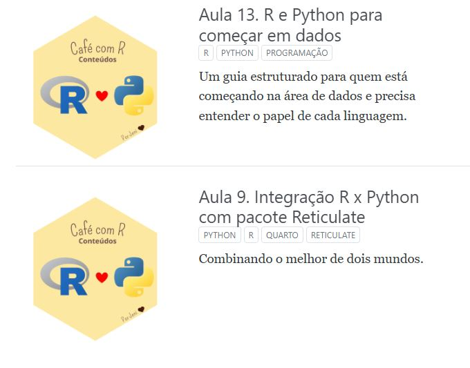{fig-align="center" width="486"}](https://jenniferlopes.quarto.pub/portifolio/apresenta%C3%A7%C3%B5es/)

------------------------------------------------------------------------

## Integração 2 - Positron, a nova IDE da Posit {.smaller}

**O que é:** O Positron é a nova IDE desenvolvida pela Posit, sucessora do RStudio, com suporte nativo a R e Python no mesmo ambiente.

**Por que existe:** O RStudio foi construído para R. O Positron foi construído para cientistas de dados que trabalham com múltiplas linguagens, sem abrir mão da experiência do RStudio.

{fig-align="center" width="306"}

------------------------------------------------------------------------

## Integração 2 - Na prática

**Principais diferenças em relação ao RStudio:**

::: incremental
-   Suporte nativo a **Python** sem necessidade do **`reticulate`** para execução interativa
-   Terminal integrado com **detecção automática** de ambiente virtual
-   **Extensões** via marketplace do VS Code - o Positron é baseado no VS Code
-   Console separado por linguagem: **`R e Python`** rodam lado a lado
-   Variáveis de **`R`** e **`Python`** visíveis no mesmo painel de ambiente
:::

------------------------------------------------------------------------

## Integração 2 - Dica importante

::: callout-tip
**Dica:** Se você já usa RStudio, o Positron mantém os atalhos de teclado e o layout familiar. A curva de transição é pequena.
:::

::: callout-warning
**Atenção:** O Positron não substitui completamente o RStudio ainda. Projetos Quarto complexos e Shiny têm suporte em evolução. Teste antes de migrar em produção.
:::

**Download:** [positron.posit.co](https://positron.posit.co)

## Integração 2 - Curso Positron

[{fig-align="center" width="450"}](https://www.youtube.com/@rladiesgoiania/featured)

**Slides - [Clique aqui](https://github.com/JenniferLopes/curso_positron_final).**

## Integração 2 - CHEATSHEET Positron

[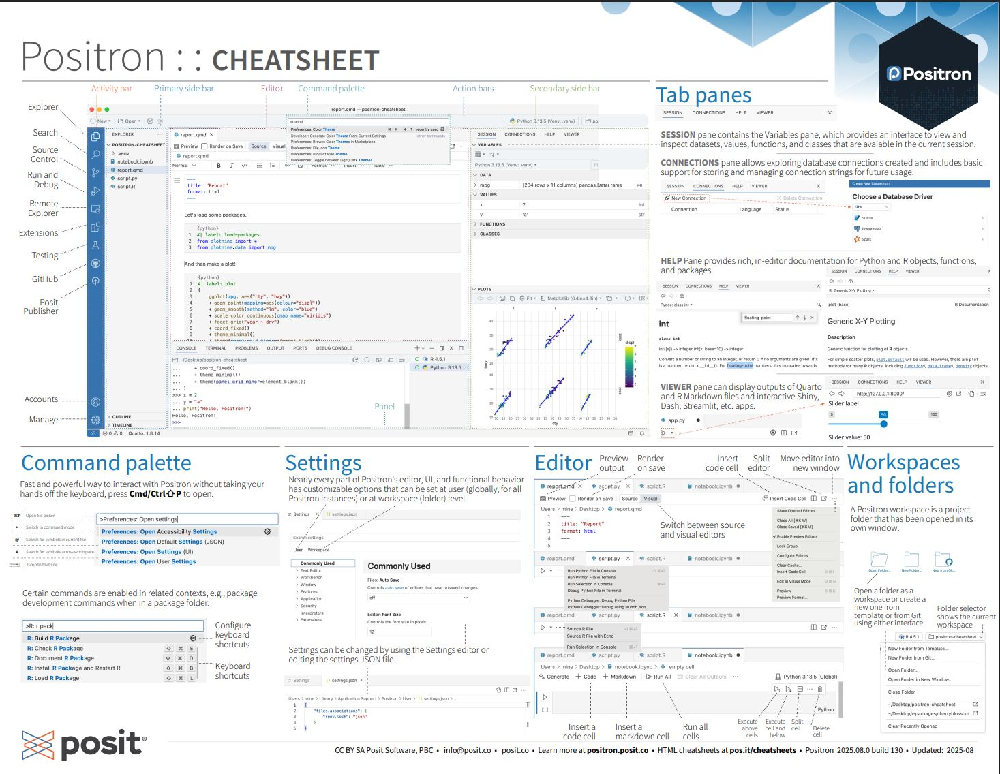{fig-align="center" width="502"}](https://posit.co/resources/cheatsheets/)

------------------------------------------------------------------------

## Integração 3 - Quarto, publicação multiplataforma {.smaller}

**O que é:** O Quarto é o sistema de publicação científica e técnica da Posit. Suporta R, Python, Julia e Observable no mesmo documento.

**Por que existe:** Substituiu o R Markdown com uma arquitetura mais moderna, independente do R e compatível com múltiplos formatos de saída.

{fig-align="center" width="409"}

------------------------------------------------------------------------

## Integração 3 - Exemplo mínimo

``` yaml
# Cabeçalho de um documento Quarto
---
title: "Minha análise"
format:
  html: default       # página web
  pdf: default        # PDF
  docx: default       # Word
  revealjs: default   # apresentação
execute:
  echo: true
  warning: false
---
```

```{r}
#| eval: false
#| echo: true

# Renderizar via R sem abrir o documento
quarto::quarto_render("meu_documento.qmd")

# Renderizar para formato específico
quarto::quarto_render("meu_documento.qmd", output_format = "pdf")
```

------------------------------------------------------------------------

## Integração 3 - Dica importante

::: callout-tip
**Dica:** Use **`quarto publish`** para publicar direto no Quarto Pub, GitHub Pages ou Posit Connect a partir do terminal, sem etapas manuais.
:::

::: callout-warning
**Atenção:** Quarto e R Markdown coexistem, mas não são intercambiáveis. A opção **`output:`** do R Markdown é **`format:`** no Quarto. Atenção ao migrar documentos antigos.
:::

**Documentação oficial:** [quarto.org](https://quarto.org)

## Integração 3 - Curso de Quarto  {.smaller}

[{fig-align="center" width="530"}](https://www.youtube.com/watch?v=XuxyzBhDvLg)

------------------------------------------------------------------------

# Bloco 2 - Controle, Versionamento e Pipelines

------------------------------------------------------------------------

## Integração 4 - GitHub via usethis {.smaller}

**O que é:** Integração do **`R`** com **`Git`** e **`GitHub`** para controle de versão, colaboração e publicação de projetos analíticos.

**Por que existe:** Análise reproduzível exige rastreabilidade. O **`Git`** registra cada alteração no código. O **`GitHub`** centraliza o projeto e permite colaboração.

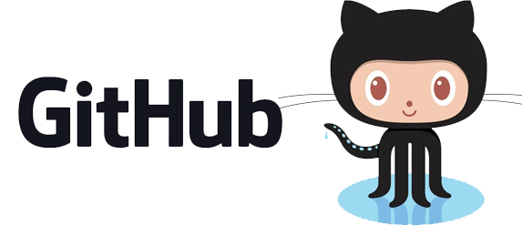{fig-align="center" width="423"}

------------------------------------------------------------------------

## Integração 4 - Exemplo mínimo

```{r}
#| eval: false
#| echo: true

# Instalar pacotes necessários
install.packages("usethis")

library(usethis)

# Configurar Git com suas credenciais
use_git_config(
  user.name  = "Seu Nome",
  user.email = "seu@email.com")

# Inicializar repositório Git no projeto atual
use_git()

# Conectar ao GitHub e criar repositório remoto
use_github(private = FALSE)

# Criar token de autenticação
create_github_token()
```

------------------------------------------------------------------------

## Integração 4 - Operações do dia a dia

```{r}
#| eval: false
#| echo: true

library(gert)

# Verificar status dos arquivos modificados
git_status()

# Adicionar arquivos ao stage
git_add(".")

# Registrar commit com mensagem descritiva
git_commit("adiciona análise exploratória de vendas")

# Enviar para o GitHub
git_push()

# Atualizar repositório local com alterações remotas
git_pull()
```

Sobre o pacote gert. [**Acesse a documentação**](https://docs.ropensci.org/gert/reference/index.html).

------------------------------------------------------------------------

## Integração 4 - Dica importante

::: callout-tip
**Dica:** Use **`usethis::use_gitignore()`** para criar um **`.gitignore`** adequado para projetos R. Isso evita que arquivos **`.Rhistory`**, **`.RData`** e dados sensíveis sejam versionados por engano.
:::

::: callout-warning
**Atenção:** Nunca versione arquivos com senhas, tokens ou dados pessoais.
:::

------------------------------------------------------------------------

## Integração 5 - Targets, pipeline reproduzível {.smaller}

**O que é:** O pacote `targets` é um sistema de orquestração de workflows analíticos para R. Ele rastreia dependências entre etapas e só reexecuta o que foi modificado.

**Por que existe:** Análises complexas têm muitas etapas. Reexecutar tudo do zero a cada mudança é ineficiente. O `targets` resolve isso de forma elegante e rastreável.

[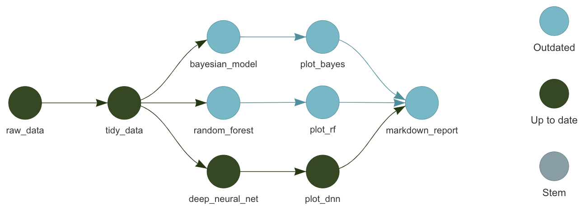{fig-align="center" width="510"}](https://github.com/ropensci-books/targets/)

------------------------------------------------------------------------

## Integração 5 - Exemplo mínimo

```{r}
#| eval: false
#| echo: true

# _targets.R - arquivo na raiz do projeto
library(targets)

# Definir opções globais do pipeline
tar_option_set(packages = c("dplyr", "ggplot2"))

# Definir as etapas do pipeline como lista de targets
list(

  # Etapa 1: carregar dados brutos
  tar_target(dados_brutos, read.csv("dados/vendas.csv")),

  # Etapa 2: limpar dados - só reexecuta se dados_brutos mudar
  tar_target(dados_limpos, dados_brutos |> filter(!is.na(valor))),

  # Etapa 3: gerar visualização - só reexecuta se dados_limpos mudar
  tar_target(grafico, ggplot(dados_limpos, aes(x = mes, y = valor)) +
               geom_col()))
```

------------------------------------------------------------------------

## Integração 5 - Executando o pipeline

```{r}
#| eval: false
#| echo: true

library(targets)

# Executar todo o pipeline
tar_make()

# Verificar o status de cada etapa
tar_visnetwork()  # visualização interativa das dependências

# Carregar resultado de uma etapa específica
tar_load(grafico)
tar_read(dados_limpos)

# Ver quais etapas estão desatualizadas
tar_outdated()
```

## Integração 5 - Targets - Tutorial no GitHub {.smaller}

[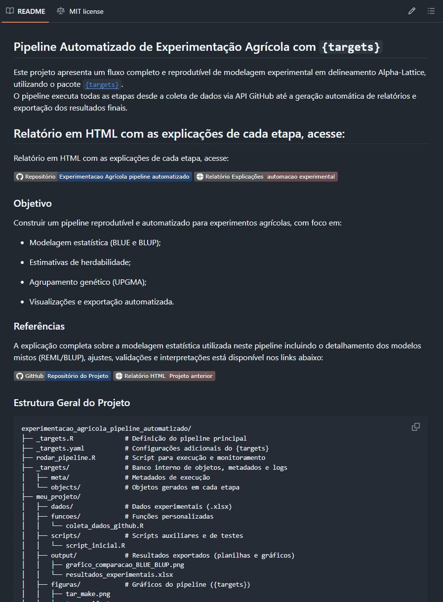{fig-align="center" width="359"}](https://github.com/JenniferLopes/experimentacao_agricola_pipeline_automatizado)

------------------------------------------------------------------------

## Integração 5 - Dica importante

::: callout-tip
**Dica:** Combine `targets` com `crew` para paralelizar etapas independentes do pipeline. Isso reduz drasticamente o tempo de execução em análises grandes.
:::

::: callout-warning
**Atenção:** O `targets` armazena os resultados em `_targets/objects/`. Nunca exclua essa pasta manualmente entre execuções. Use `tar_invalidate()` para forçar reexecução de etapas específicas.
:::

**Documentação:** [docs.ropensci.org/targets](https://docs.ropensci.org/targets/)

------------------------------------------------------------------------

## Integração 6 - Docker com R {.smaller}

**O que é:** Docker é uma plataforma de containerização que empacota o código, as dependências e o ambiente de execução em uma unidade portátil e reproduzível.

**Por que existe:** "Funciona na minha máquina" é um problema real em ciência de dados. Docker elimina diferenças de ambiente entre desenvolvimento, teste e produção.

{fig-align="center" width="130"}

------------------------------------------------------------------------

## Integração 6 - Exemplo mínimo de Dockerfile

``` dockerfile
# Imagem base oficial do R com versão fixada
FROM rocker/r-ver:4.4.0

# Instalar dependências do sistema operacional
RUN apt-get update && apt-get install -y \
    libcurl4-openssl-dev \
    libssl-dev \
    libxml2-dev

# Instalar pacotes R necessários
RUN R -e "install.packages(c('tidyverse', 'plumber'), repos='https://cran.r-project.org')"

# Copiar scripts para dentro do container
COPY . /app
WORKDIR /app

# Executar o script principal ao iniciar o container
CMD ["Rscript", "analise.R"]
```

------------------------------------------------------------------------

## Integração 6 - Comandos essenciais

``` bash
# Construir a imagem a partir do Dockerfile
docker build -t minha-analise-r .

# Executar o container
docker run minha-analise-r

# Executar com volume - monta a pasta local dentro do container
docker run -v $(pwd)/dados:/app/dados minha-analise-r

# Executar com Shiny exposto na porta 3838
docker run -p 3838:3838 minha-analise-r
```

------------------------------------------------------------------------

## Integração 6 - Dica importante

::: callout-tip
**Dica:** Use as imagens do projeto [`Rocker`](https://rocker-project.org/) como base. Elas são mantidas pela comunidade R e já incluem o ambiente correto para diferentes casos de uso: **`rocker/tidyverse`**, **`rocker/shiny`**, **`rocker/ml`**.
:::

::: callout-warning
**Atenção:** Instalar pacotes R dentro do Dockerfile sem fixar versões pode quebrar a imagem em builds futuros. Use **`renv`** para registrar versões exatas dos pacotes e restaurá-las no container.
:::

------------------------------------------------------------------------

# Bloco 3 - Dados e Bancos de Dados

------------------------------------------------------------------------

## Integração 7 - PostgreSQL e DuckDB via DBI {.smaller}

**O que é:** O pacote **`DBI`** é a interface padrão do R para bancos de dados relacionais. Com ele, é possível conectar, consultar e escrever em **PostgreSQL**, **MySQL**, **SQLite**, **DuckDB** e outros.

**Por que existe:** Dados em produção raramente estão em arquivos CSV. Eles vivem em bancos de dados. O **`DBI`** com `dbplyr` permite usar a sintaxe do **`dplyr`** para consultar qualquer banco.

[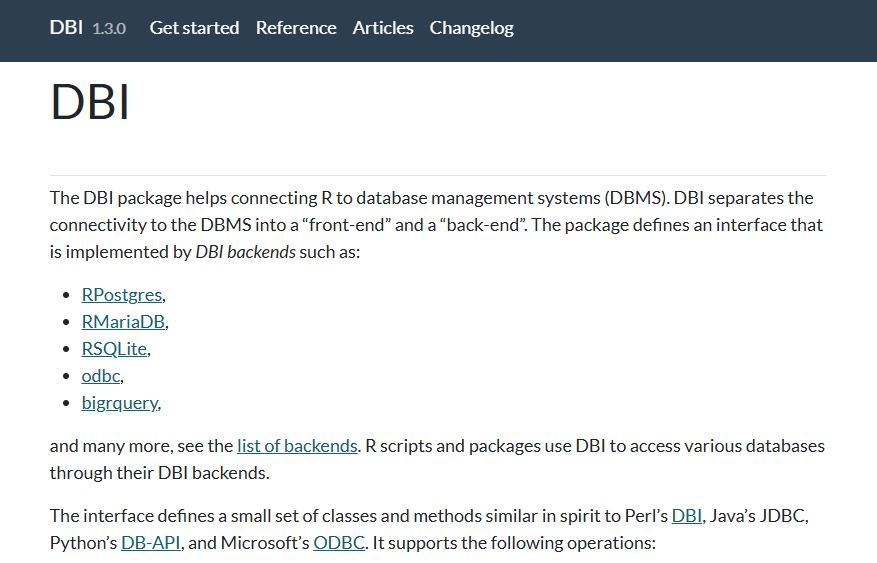{fig-align="center" width="552"}](https://dbi.r-dbi.org/index.html)

------------------------------------------------------------------------

## Integração 7 - Conectando ao PostgreSQL

```{r}
#| eval: false
#| echo: true

library(DBI)
library(RPostgres)
library(dplyr)
library(dbplyr)

# Estabelecer conexão com PostgreSQL
con <- dbConnect(
  drv      = Postgres(),
  host     = "localhost",
  port     = 5432,
  dbname   = "meu_banco",
  user     = Sys.getenv("DB_USER"),     # nunca escrever credenciais no código
  password = Sys.getenv("DB_PASSWORD"))

# Listar tabelas disponíveis
dbListTables(con)

# Referenciar tabela sem carregar na memória
tabela_remota <- tbl(con, "vendas")
```

------------------------------------------------------------------------

## Integração 7 - Consultando com dbplyr

```{r}
#| eval: false
#| echo: true

library(dplyr)

# O dbplyr traduz dplyr para SQL automaticamente
resultado <- tabela_remota |>
  filter(ano == 2024) |>
  group_by(regiao) |>
  summarise(total = sum(valor, na.rm = TRUE)) |>
  arrange(desc(total))

# Ver o SQL gerado antes de executar
show_query(resultado)

# Executar e trazer resultado para o R
dados_locais <- collect(resultado)

# Fechar conexão ao finalizar
dbDisconnect(con)
```

------------------------------------------------------------------------

## Integração 7 - DuckDB local

```{r}
#| eval: false
#| echo: true

library(DBI)
library(duckdb)

# DuckDB: banco analítico local, sem servidor, extremamente rápido
con_duck <- dbConnect(duckdb::duckdb(), dbdir = "meu_banco.duckdb")

# Criar tabela a partir de um data frame
dbWriteTable(con_duck, "vendas", dados_vendas, overwrite = TRUE)

# Consultar com SQL diretamente
dbGetQuery(con_duck, "
  SELECT regiao, SUM(valor) AS total
  FROM vendas
  WHERE ano = 2024
  GROUP BY regiao
  ORDER BY total DESC")

dbDisconnect(con_duck)
```

------------------------------------------------------------------------

## Integração 7 - Dica importante

::: callout-tip
**Dica:** Armazene credenciais de banco no arquivo **`.Renviron`** e acesse com **`Sys.getenv()`**. Nunca escreva usuário e senha diretamente no script. Use **`usethis::edit_r_environ()`** para abrir o arquivo.
:::

::: callout-warning
**Atenção:** **`collect()`** traz todos os dados para a memória do R. Em tabelas grandes, aplique todos os filtros e agregações antes de executar o **`collect()`**.
:::

------------------------------------------------------------------------

## Integração 8 - Arrow e Parquet {.smaller}

**O que é:** O pacote **`arrow`** permite ler, escrever e processar arquivos Parquet e datasets particionados sem carregar tudo na memória RAM.

**Por que existe:** Parquet é o formato padrão de armazenamento analítico em ambientes de nuvem e data lakes. É colunar, comprimido e muito mais eficiente que CSV para grandes volumes.

[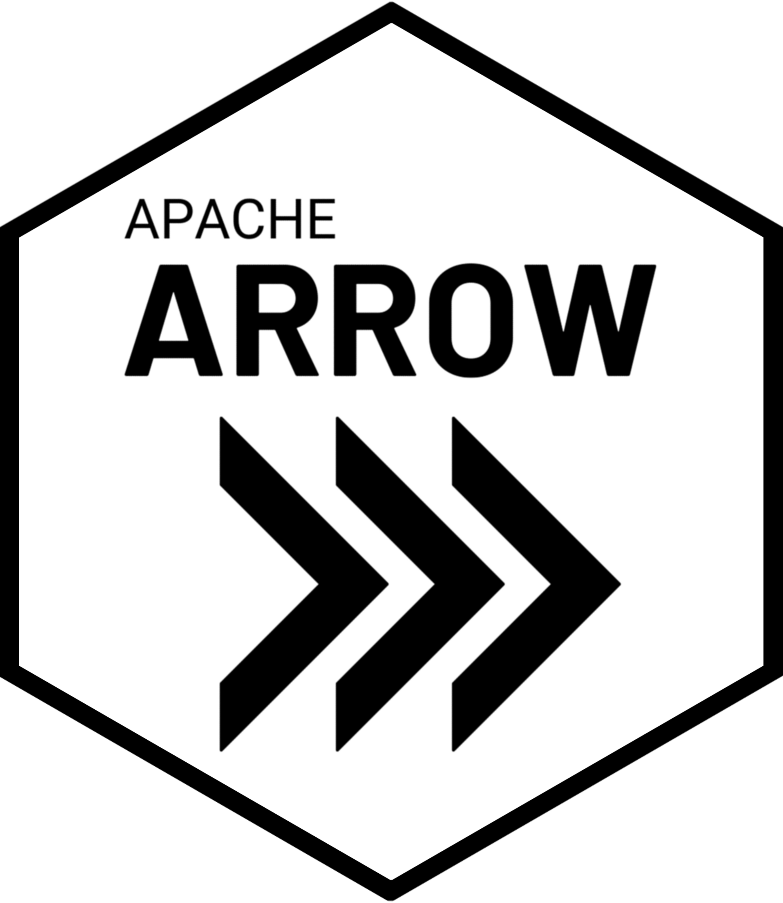{fig-align="center" width="331"}](https://arrow.apache.org/docs/r/)

------------------------------------------------------------------------

## Integração 8 - Exemplo mínimo

```{r}
#| eval: false
#| echo: true

library(arrow)
library(dplyr)

# Escrever um data frame como Parquet
write_parquet(dados, "dados/vendas_2024.parquet")

# Ler arquivo Parquet
vendas <- read_parquet("dados/vendas_2024.parquet")

# Leitura lazy: sem carregar na memória
vendas_lazy <- open_dataset("dados/vendas_2024.parquet")

# Filtrar e agregar antes de trazer para o R
resultado <- vendas_lazy |>
  filter(regiao == "Sul") |>
  group_by(mes) |>
  summarise(total = sum(valor)) |>
  collect()  # apenas aqui os dados entram na memória
```

------------------------------------------------------------------------

## Integração 8 - Dataset particionado

```{r}
#| eval: false
#| echo: true

library(arrow)
library(dplyr)

# Escrever dataset particionado por ano e mes
write_dataset(
  dataset   = dados,
  path      = "dados/vendas/",
  format    = "parquet",
  partitioning = c("ano", "mes"))  # cria subpastas automaticamente

# Ler apenas a partição necessária - muito mais rápido
vendas_jan <- open_dataset("dados/vendas/") |>
  filter(ano == 2024, mes == 1) |>
  collect()
```

------------------------------------------------------------------------

## Integração 8 - Dica importante

::: callout-tip
**Dica:** Combine **`arrow`** com **`duckdb`** para análises em datasets muito grandes. O DuckDB consegue consultar arquivos Parquet diretamente com performance superior ao **`arrow`** puro em operações complexas.
:::

::: callout-warning
**Atenção:** Ao particionar datasets, escolha as colunas de partição com cuidado. Particionar por uma coluna com muitos valores únicos (como ID de cliente) cria milhares de arquivos pequenos e degrada a performance.
:::

------------------------------------------------------------------------

## Integração 9 - APIs REST via httr2 {.smaller}

**O que é:** O pacote **`httr2`** permite fazer requisições HTTP para consumir APIs REST diretamente no R, com controle de autenticação, paginação e tratamento de erros.

**Por que existe:** Grande parte dos dados modernos são acessíveis via API - redes sociais, plataformas financeiras, sistemas internos, serviços de governo. O **`httr2`** é a porta de entrada do R para esse ecossistema.

[{fig-align="center" width="169"}](https://httr2.r-lib.org/reference/index.html)

------------------------------------------------------------------------

## Integração 9 - Exemplo mínimo

```{r}
#| eval: false
#| echo: true

library(httr2)
library(jsonlite)

# Construir e executar requisição GET
resposta <- request("https://servicodados.ibge.gov.br/api/v1/localidades/estados") |>
  req_headers(Accept = "application/json") |>
  req_perform()

# Verificar status da resposta
resp_status(resposta)

# Extrair e converter o JSON
estados <- resposta |>
  resp_body_string() |>
  fromJSON()

head(estados[, c("id", "sigla", "nome")])
```

------------------------------------------------------------------------

## Integração 9 - Requisição com autenticação

```{r}
#| eval: false
#| echo: true

library(httr2)

# Requisição com token Bearer - padrão OAuth2
resposta <- request("https://api.exemplo.com/dados") |>
  req_auth_bearer_token(Sys.getenv("API_TOKEN")) |>
  req_url_query(ano = 2024, formato = "json") |>
  req_retry(max_tries = 3) |>       # tentar 3 vezes em caso de erro
  req_throttle(rate = 10 / 60) |>   # máximo 10 requisições por minuto
  req_perform()

# Tratar erros HTTP automaticamente
resp_check_status(resposta)

dados <- resposta |>
  resp_body_json(simplifyVector = TRUE)
```

------------------------------------------------------------------------

## Integração 9 - Dica importante

::: callout-tip
**Dica:** Use **`req_retry()`** em combinação com **`req_throttle()`** para consumir APIs com limites de requisição. Isso evita bloqueios por excesso de chamadas e torna o script resiliente a falhas temporárias.
:::

::: callout-warning
**Atenção:** Nunca armazene tokens de API diretamente no script. Use **`.Renviron`** com **`Sys.getenv("NOME_DO_TOKEN")`**. Para gerenciar múltiplos tokens com segurança, o pacote **`keyring`** é uma boa alternativa.
:::

## Integração 9 - APIs REST - Aula {.smaller}

[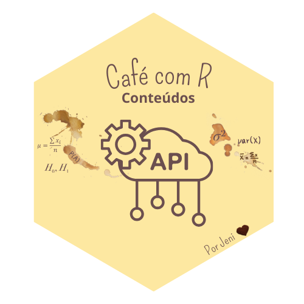{fig-align="center" width="456"}](https://jenniferlopes.quarto.pub/portifolio/apresenta%C3%A7%C3%B5es/posts/api_R.html)

------------------------------------------------------------------------

# Bloco 4 - Nuvem e Plataformas

------------------------------------------------------------------------

## Integração 10 - Google Cloud Platform via bigrquery {.smaller}

**O que é:** O pacote **`bigrquery`** conecta o R diretamente ao BigQuery, o data warehouse serverless do Google Cloud, permitindo consultar petabytes de dados com SQL.

**Por que existe:** BigQuery é amplamente usado em empresas que trabalham com grandes volumes de dados. O **`bigrquery`** traz esses dados para o ambiente R sem precisar exportar arquivos.

[{fig-align="center" width="346"}](https://docs.cloud.google.com/bigquery/docs/bigquery-ready-overview?hl=pt-br)

------------------------------------------------------------------------

## Integração 10 - Exemplo mínimo

```{r}
#| eval: false
#| echo: true

library(bigrquery)
library(DBI)

# Autenticar com conta Google - abre navegador na primeira vez
bq_auth(email = "seu@email.com")

# Conectar ao projeto BigQuery
con <- dbConnect(
  drv     = bigquery(),
  project = "meu-projeto-gcp",
  dataset = "meu_dataset",
  billing = "meu-projeto-gcp")   # projeto que receberá a cobrança

# Consultar tabela pública do BigQuery
query <- "
  SELECT ano, SUM(valor) AS total
  FROM `meu-projeto-gcp.meu_dataset.vendas`
  WHERE ano >= 2022
  GROUP BY ano
  ORDER BY ano
"

resultado <- dbGetQuery(con, query)
```

------------------------------------------------------------------------

## Integração 10 - Com dbplyr

```{r}
#| eval: false
#| echo: true

library(dplyr)
library(dbplyr)

# Referenciar tabela do BigQuery
tabela_bq <- tbl(con, "vendas")

# Usar dplyr normalmente - o dbplyr traduz para SQL do BigQuery
resultado <- tabela_bq |>
  filter(ano >= 2022) |>
  group_by(ano, regiao) |>
  summarise(total = sum(valor, na.rm = TRUE), .groups = "drop") |>
  arrange(desc(total)) |>
  collect()  # executa a query e traz resultado para o R

dbDisconnect(con)
```

------------------------------------------------------------------------

## Integração 10 - Dica importante

::: callout-tip
**Dica:** Em projetos com múltiplos colaboradores, use a autenticação via conta de serviço em vez de conta pessoal. Crie uma chave JSON no GCP Console e autentique com **`bq_auth(path = "chave.json")`**.
:::

::: callout-warning
**Atenção:** O BigQuery cobra por volume de dados processado na consulta, não por tempo. Filtre as partições explicitamente no WHERE e evite **`SELECT *`** em tabelas grandes para controlar custos.
:::

## Integração 10 - Google Cloud Platform via bigrquery- Projeto no GitHub {.smaller}

[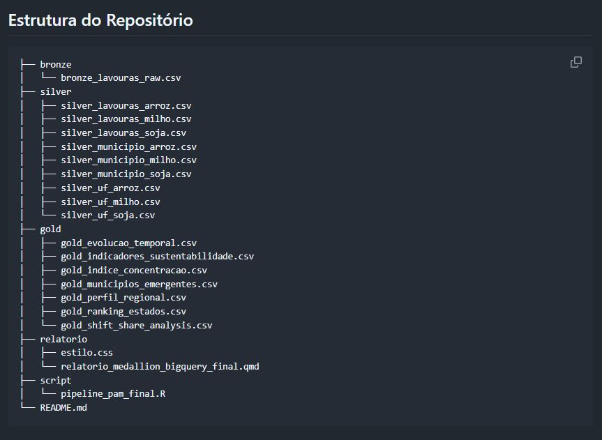{fig-align="center" width="553"}](https://github.com/JenniferLopes/bigquery_pam)

------------------------------------------------------------------------

## Integração 11 - Databricks via odbc {.smaller}

**O que é:** O Databricks é uma plataforma de dados baseada em Apache Spark. A conexão com R é feita via ODBC ou pelo pacote `sparklyr`, permitindo executar análises em clusters de alto desempenho.

**Por que existe:** Empresas com grandes volumes de dados usam Databricks como plataforma central de analytics e ML. Integrar R com Databricks significa levar análises R para a escala corporativa.

[{fig-align="center" width="215"}](https://odbc.r-dbi.org/reference/databricks.html)

## Integração 11 - Databricks via odbc {.smaller}

[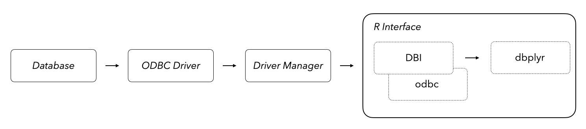{fig-align="center"}](https://github.com/r-dbi/odbc)

------------------------------------------------------------------------

## Integração 11 - Conectando via ODBC

```{r}
#| eval: false
#| echo: true

library(DBI)
library(odbc)

# Conexão via ODBC com Databricks
# Requer instalação do driver ODBC da Databricks
con <- dbConnect(
  drv               = odbc::odbc(),
  Driver            = "Simba Spark ODBC Driver",
  Host              = Sys.getenv("DATABRICKS_HOST"),
  Port              = 443,
  HTTPPath          = Sys.getenv("DATABRICKS_HTTP_PATH"),
  AuthMech          = 3,
  UID               = "token",
  PWD               = Sys.getenv("DATABRICKS_TOKEN"),
  ThriftTransport   = 2,
  SSL               = 1)

# Listar tabelas disponíveis no schema
dbGetQuery(con, "SHOW TABLES IN meu_schema")
```

------------------------------------------------------------------------

## Integração 11 - Consultando Delta Tables

```{r}
#| eval: false
#| echo: true

library(dplyr)
library(dbplyr)

# Referenciar Delta Table no Databricks
vendas <- tbl(con, dbplyr::in_catalog("hive_metastore", "meu_schema", "vendas"))

# Consultar com dplyr - traduzido para Spark SQL
resultado <- vendas |>
  filter(ano == 2024) |>
  group_by(regiao) |>
  summarise(total = sum(valor, na.rm = TRUE)) |>
  collect()

dbDisconnect(con)
```

------------------------------------------------------------------------

## Integração 11 - Dica importante

::: callout-tip
**Dica:** Armazene as credenciais do Databricks no `.Renviron`: `DATABRICKS_HOST`, `DATABRICKS_TOKEN` e `DATABRICKS_HTTP_PATH`. Isso garante que o script funcione em qualquer máquina sem expor dados sensíveis.
:::

::: callout-warning
**Atenção:** A conexão ODBC com Databricks requer que o driver da Simba esteja instalado no sistema operacional. Em ambientes Docker, inclua a instalação do driver no Dockerfile para garantir reprodutibilidade.
:::

------------------------------------------------------------------------

## Integração 12 - Spark via sparklyr {.smaller}

**O que é:** O pacote `sparklyr` conecta o R ao Apache Spark, permitindo processar datasets distribuídos com a sintaxe familiar do `dplyr`.

**Por que existe:** Quando os dados não cabem na memória de uma única máquina, o Spark distribui o processamento em um cluster. O `sparklyr` torna essa escala acessível para usuários de R.

{fig-align="center"}

## Integração 12 - Spark via sparklyr {.smaller}

[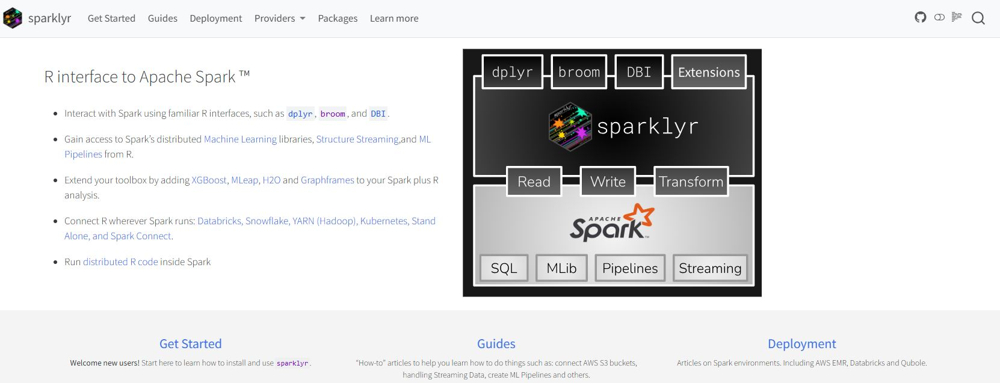{fig-align="center" width="550"}](https://spark.posit.co/)

------------------------------------------------------------------------

## Integração 12 - Exemplo mínimo

```{r}
#| eval: false
#| echo: true

library(sparklyr)
library(dplyr)

# Instalar Spark localmente para desenvolvimento
spark_install(version = "3.5")

# Conectar ao Spark local
sc <- spark_connect(master = "local")

# Copiar data frame para o Spark
vendas_spark <- copy_to(sc, dados_vendas, "vendas", overwrite = TRUE)

# Processar com dplyr - executa no Spark
resultado <- vendas_spark |>
  filter(ano == 2024) |>
  group_by(regiao) |>
  summarise(total = sum(valor, na.rm = TRUE)) |>
  collect()

spark_disconnect(sc)
```

------------------------------------------------------------------------

## Integração 12 - Conectando a cluster remoto

```{r}
#| eval: false
#| echo: true

library(sparklyr)

# Conectar a cluster Spark remoto (YARN, Kubernetes ou Databricks)
sc <- spark_connect(
  master = "yarn",
  config = spark_config())

# Ler arquivo Parquet direto do HDFS ou S3
dados_hdfs <- spark_read_parquet(
  sc,
  name = "vendas",
  path = "hdfs://caminho/para/vendas/")

# Ver plano de execução do Spark
dados_hdfs |>
  filter(regiao == "Sul") |>
  spark_explain()
```

------------------------------------------------------------------------

## Integração 12 - Dica importante

::: callout-tip
**Dica:** Use **`spark_connect(master = "local")`** durante o desenvolvimento para testar o código localmente antes de executar no cluster. O comportamento do **`dplyr`** é idêntico nos dois modos.
:::

::: callout-warning
**Atenção:** **`collect()`** no Spark traz todos os dados para a memória do R. Em datasets grandes, isso pode travar ou derrubar a sessão. Sempre agregue antes de coletar.
:::

------------------------------------------------------------------------

# Bloco 5 - Produção e MLOps

------------------------------------------------------------------------

## Integração 13 - Plumber, R como API REST {.smaller}

**O que é:** O pacote `plumber` transforma funções R em endpoints de API REST. Com uma anotação simples no código, qualquer função passa a ser acessível via HTTP.

**Por que existe:** Modelos e análises em R precisam ser consumidos por outros sistemas - aplicações web, dashboards externos, pipelines de dados. O Plumber é a ponte entre o R e esses sistemas.

[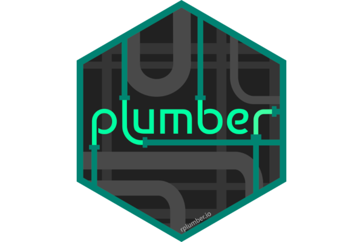{fig-align="center" width="425"}](https://www.rplumber.io/)

------------------------------------------------------------------------

## Integração 13 - Exemplo mínimo

```{r}
#| eval: false
#| echo: true

# arquivo: plumber.R

library(plumber)

# Endpoint GET simples
#* @get /status
function() {
  list(status = "ativo", versao = "1.0.0")
}

# Endpoint POST que recebe dados e retorna previsão
#* @post /prever
#* @param valor:numeric Valor de entrada para o modelo
function(valor) {
  # modelo carregado previamente com readRDS()
  predicao <- predict(modelo, newdata = data.frame(x = as.numeric(valor)))
  list(entrada = valor, predicao = predicao)
}
```

------------------------------------------------------------------------

## Integração 13 - Iniciando a API

```{r}
#| eval: false
#| echo: true

library(plumber)

# Carregar e iniciar a API localmente
api <- plumb("plumber.R")
api$run(port = 8000)

# Testar via R com httr2
library(httr2)

request("http://localhost:8000/status") |>
  req_perform() |>
  resp_body_json()

# Testar endpoint POST
request("http://localhost:8000/prever") |>
  req_method("POST") |>
  req_url_query(valor = 42) |>
  req_perform() |>
  resp_body_json()
```

------------------------------------------------------------------------

## Integração 13 - Dica importante

::: callout-tip
**Dica:** Use o arquivo `entrypoint.R` para iniciar a API no Docker. Combine com `rocker/plumber` como imagem base para deploy consistente em qualquer ambiente de nuvem.
:::

::: callout-warning
**Atenção:** O Plumber é single-threaded por padrão. Para produção com múltiplas requisições simultâneas, configure workers com o pacote `promises` e `future`, ou use o Posit Connect que gerencia isso automaticamente.
:::

**Documentação:** [www.rplumber.io](https://www.rplumber.io/)

------------------------------------------------------------------------

## Integração 14 - Shiny em produção {.smaller}

**O que é:** Shiny é o framework do R para criar aplicações web interativas. Colocar um app Shiny em produção significa torná-lo acessível, estável e seguro para usuários externos.

**Por que existe:** Análises em R precisam chegar a quem toma decisões. Shiny transforma scripts R em interfaces navegáveis, sem exigir que o usuário final conheça programação.

[{fig-align="center" width="195"}](https://rstudio.github.io/cheatsheets/html/shiny.html)

------------------------------------------------------------------------

## Integração 15 - Opções de deploy

| **Plataforma**      | **Perfil**                    | **Custo**      |
|---------------------|-------------------------------|----------------|
| shinyapps.io        | Individual e pequenas equipes | Freemium       |
| Posit Connect       | Corporativo e times           | Pago           |
| Hugging Face Spaces | Comunidade e portfólio        | Gratuito       |
| Servidor próprio    | Controle total                | Infraestrutura |
| Docker + nuvem      | Produção escalável            | Infraestrutura |

------------------------------------------------------------------------

## Integração 15 - Deploy no shinyapps.io

```{r}
#| eval: false
#| echo: true

library(rsconnect)

# Configurar conta shinyapps.io - executar uma vez
rsconnect::setAccountInfo(
  name   = "seu-usuario",
  token  = Sys.getenv("SHINYAPPS_TOKEN"),
  secret = Sys.getenv("SHINYAPPS_SECRET"))

# Deploy do app
rsconnect::deployApp(
  appDir  = "meu_app/",
  appName = "analise-vendas",
  forceUpdate = TRUE)

# Verificar status do deploy
rsconnect::showLogs(appName = "analise-vendas")
```

------------------------------------------------------------------------

## Integração 15 - Deploy no Hugging Face

```{r}
#| eval: false
#| echo: true

# Estrutura necessária no repositório Hugging Face
# meu-app/
# ├── app.R          <- app Shiny
# ├── Dockerfile     <- configuração do container
# └── README.md      <- metadados do Space

# Dockerfile para Shiny no Hugging Face
```

``` dockerfile
FROM rocker/shiny:4.4.0

RUN R -e "install.packages(c('tidyverse', 'shinydashboard'))"

COPY app.R /srv/shiny-server/app/app.R

EXPOSE 7860

CMD ["/usr/bin/shiny-server"]
```

------------------------------------------------------------------------

## Integração 15 - Dica importante

::: callout-tip
**Dica:** Use o pacote `golem` para estruturar Shiny apps como pacotes R. Isso facilita testes automatizados, deploy consistente e manutenção em equipe. É o padrão recomendado para apps de produção.
:::

::: callout-warning
**Atenção:** Apps Shiny que carregam dados a cada sessão de usuário escalam mal. Pré-processe e salve os dados como `.rds` ou `.parquet` fora do app. Dentro do app, apenas leia e filtre.
:::

## Integração 14 - Shiny em produção - **Cheatsheet** {.smaller}

[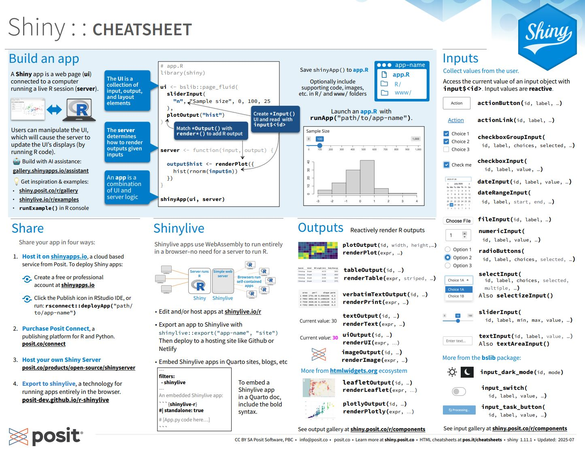{fig-align="center" width="524"}](https://rstudio.github.io/cheatsheets/html/shiny.html)

------------------------------------------------------------------------

# Resumo e próximos passos

------------------------------------------------------------------------

## Tabela resumo - Bloco 1 e 2

| **Integração** | **Pacote principal** |
|----------------|----------------------|
| Python         | reticulate           |
| Positron       | \-                   |
| Quarto         | quarto               |
| GitHub         | usethis, gert        |
| Targets        | targets              |
| Docker         | \-                   |

------------------------------------------------------------------------

## Tabela resumo - Bloco 3 e 4

| **Integração**    | **Pacote principal** |
|-------------------|----------------------|
| PostgreSQL/DuckDB | DBI, dbplyr          |
| Arrow e Parquet   | arrow                |
| APIs REST         | httr2                |
| GCP BigQuery      | bigrquery            |
| Databricks        | odbc, dbplyr         |
| Spark             | sparklyr             |

------------------------------------------------------------------------

## Tabela resumo - Bloco 5

| **Integração**    | **Pacote principal** |
|-------------------|----------------------|
| Plumber           | plumber              |
| Shiny em produção | rsconnect, golem     |

------------------------------------------------------------------------

## Trilha de aprendizado recomendada

::: incremental
1.  **Comece pelo GitHub** - controle de versão é fundação para tudo
2.  **Avance para Quarto** - documentação reproduzível é essencial
3.  **Aprenda DBI e dbplyr** - dados reais vivem em bancos
4.  **Explore Arrow e httr2** - formatos modernos e APIs são ubíquos
5.  **Construa com Plumber e Shiny** - leve suas análises para produção
6.  **Aprofunde em Targets**
7.  **Escale com Spark, BigQuery e Databricks** - quando os dados crescerem
:::

------------------------------------------------------------------------

## Próximos passos

::: incremental
1.  Escolha uma **integração relevante para seu contexto atual**
2.  Execute o **exemplo mínimo** em uma máquina local
3.  Aplique em um **projeto real**, mesmo que pequeno
4.  Documente o processo em **Quarto** e publique no **GitHub**
5.  Compartilhe com a comunidade - ensinar é a melhor forma de aprender
:::

------------------------------------------------------------------------

## Obrigada!

{fig-align="center" width="407"}

**Continue praticando e explorando!**

*Esta apresentação é parte do projeto `Café com R!` É OPEN, USE, COMPARTILHE!*

------------------------------------------------------------------------

## Siga o Café com R

**Fique por dentro das aulas, conteúdos e newsletter!**

> **Que cada gole desperte uma nova ideia.**
>
> **Que cada script abra uma nova conversa.**
>
> **Que o Café com R se torne um ponto de encontro nosso!**

[{fig-align="center" style="border: 3px solid #6B4F4F; border-radius: 12px; padding: 6px;" width="326"}](https://jenniferlopes.quarto.pub/portifolio/)
