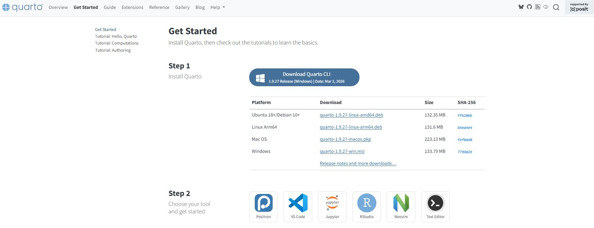
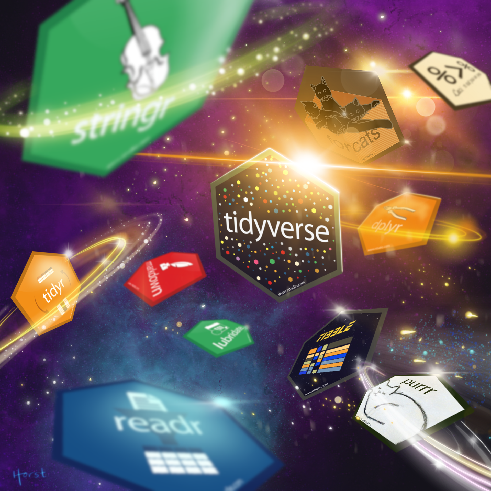

## **Democratização**

> **Esta aula foi pensada para quem está no início da jornada em dados e quer tomar decisões de aprendizado com consciência, não com pressa.**


## Acompanhe o café com R

[{style="border: 3px solid #6B4F4F; border-radius: 12px; padding: 6px;" fig-align="center" width="438"}](https://jenniferlopes.quarto.pub/portifolio/)

## Onde criei essa aula?

1.  No quarto - [**acesse aqui**](https://quarto.org).

2.  No R - [**acesse aqui**](https://cran.r-project.org).

3.  No RStudio - [**acesse aqui**](https://posit.co/download/rstudio-desktop/).

{style="border: 3px solid #6B4F4F; border-radius: 12px; padding: 6px;" fig-align="center" width="611" height="258"}

## **Objetivos da apresentação**

::: incremental
-   **Entender o papel de `R` e `Python` no contexto de dados**
-   **Comparar as linguagens com critérios técnicos e práticos**
-   **Definir uma estratégia de aprendizado por perfil**
-   **Conhecer os primeiros pacotes e recursos de cada linguagem**
-   **Construir uma base sólida antes de avançar**
:::

# **O contexto: por que aprender a programar para dados?**

## **Dados estão em todo lugar**

A capacidade de **coletar**, **transformar** e **comunicar dados** se tornou uma competência fundamental em praticamente todas as áreas do conhecimento.

::: incremental
-   Ciências exatas, humanas e biológicas utilizam dados em seus processos
-   O mercado de trabalho valoriza profissionais que automatizam análises
-   Planilhas não escalam - código escala
-   Reprodutibilidade é um requisito em ciência e em negócios
:::

## **Por que não basta Excel?**

::: incremental
-   Excel não é auditável: cada clique é invisível
-   Não suporta grandes volumes de dados com eficiência
-   Dificuldade de colaboração e versionamento
-   Automatização limitada e frágil
-   Não integra com bancos de dados, APIs ou modelos estatísticos
:::

::: callout-note
Excel é uma ferramenta legítima para exploração inicial. O problema é quando ele se torna o único instrumento de análise.
:::

## **R e Python: linguagens de propósito analítico**

**Ambas foram desenvolvidas com foco em análise de dados, estatística e computação científica.**

::: incremental
-   **R:** criada por estatísticos, para estatísticos
-   **Python:** criada para legibilidade e uso geral, adotada fortemente por cientistas de dados
-   Ambas são **gratuitas**, de **código aberto** e com **comunidades ativas**
:::

# **Entendendo as linguagens**

## **O que é R?**

R é uma linguagem e ambiente de computação estatística criada por Ross Ihaka e Robert Gentleman na Universidade de Auckland, em 1993.

::: incremental
-   Focada em análise estatística e visualização
-   Sintaxe projetada para trabalhar com dados tabulares
-   Ecosistema do Tidyverse: coerente, legível e poderoso
-   Forte presença em pesquisa acadêmica, epidemiologia, econometria e ciências sociais
:::

## **O que é Python?**

Python é uma linguagem de programação de propósito geral criada por Guido van Rossum em 1991, com filosofia de legibilidade e simplicidade.

::: incremental
-   Amplamente adotada em ciência de dados, machine learning e automação
-   Sintaxe próxima da linguagem natural
-   Ecosistema com pandas, NumPy, scikit-learn, TensorFlow
-   Forte presença na indústria, startups e engenharia de dados
:::

## **R x Python - visão geral minha opinião**

| **Dimensão** | **R** | **Python** |
|------------------------|------------------------|------------------------|
| Origem | Estatística acadêmica | Programação geral |
| Ponto forte principal | Análise estatística | Machine learning e automação |
| Curva de aprendizado | Moderada para dados tabulares | Moderada com sintaxe mais direta |
| Visualização nativa | ggplot2 - expressivo e elegante | matplotlib e seaborn |
| Comunidade acadêmica | Muito forte | Crescente |

## **R x Python - aplicações minha opinião**

| **Área**                | **R**     | **Python** |
|-------------------------|-----------|------------|
| Estatística inferencial | Excelente | Bom        |
| Visualização de dados   | Excelente | Muito bom  |
| Machine learning        | Bom       | Excelente  |
| Deep learning           | Limitado  | Excelente  |
| Web scraping            | Bom       | Excelente  |
| Automação de processos  | Limitado  | Excelente  |
| Relatórios e documentos | Excelente | Bom        |
| Manipulação de dados    | Excelente | Excelente  |

# **Qual aprender primeiro?**

## **Não existe resposta universal**

A escolha depende de três fatores principais:

::: incremental
1.  **Objetivo profissional ou acadêmico**
2.  **Área de atuação ou interesse**
3.  **Contexto da equipe ou da instituição**
:::

::: callout-tip
## Recomendação

Defina sua área antes de escolher a linguagem. A linguagem é um instrumento - o problema que você quer resolver é o ponto de partida.
:::

## **Perfil 1 - Pesquisa e academia**

Se o objetivo é análise estatística, publicação científica ou trabalho com dados observacionais:

::: incremental
-   **Comece com R**
-   O Tidyverse oferece uma gramática coerente para análise de dados
-   ggplot2 é a ferramenta de visualização mais expressiva disponível
-   R Markdown e Quarto integram código, texto e resultados em documentos reproduzíveis
-   A comunidade acadêmica é ampla e os pacotes são especializados
:::

## **Perfil 2 - Mercado e indústria**

Se o objetivo é trabalhar com engenharia de dados, machine learning aplicado ou automação:

::: incremental
-   **Comece com Python**
-   A demanda por Python no mercado de trabalho é mais ampla
-   A integração com sistemas, APIs e bancos de dados é mais natural
-   scikit-learn, TensorFlow e PyTorch são referências em machine learning
-   A curva de aprendizado é suave para quem está começando do zero
:::

## **Perfil 3 - Análise de dados generalista**

Se o objetivo é explorar dados, gerar relatórios e apoiar decisões em diferentes contextos:

::: incremental
-   **As duas linguagens se complementam**
-   R para análise exploratória, visualização e estatística
-   Python para automação, coleta e modelagem
-   O pacote Reticulate permite integrar as duas no mesmo projeto
-   A combinação é um diferencial real no mercado
:::

## Tem aula aqui no site

{style="border: 3px solid #6B4F4F; border-radius: 12px; padding: 6px;" fig-align="center" width="268"}

::: callout-note
Consulte os slides anteriores para detalhes sobre o pacote Reticulate. Link [**aqui**](https://jenniferlopes.quarto.pub/portifolio/apresenta%C3%A7%C3%B5es/posts/apresentacao_r_python.html#/title-slide).
:::

# **Começando com R**

## **O ambiente de trabalho em R**

Para iniciar com R, três ferramentas são necessárias:

::: incremental
1.  **R** - o motor da linguagem: [cran.r-project.org](https://cran.r-project.org/)
2.  **RStudio** - interface de desenvolvimento: [posit.co/download/rstudio-desktop](https://posit.co/download/rstudio-desktop/)
3.  **Quarto** - sistema de publicação: [quarto.org](https://quarto.org/)
:::

## **Primeiros passos no R**

```{r}
#| eval: false
#| echo: true

# Atribuição de valores
x <- 10
y <- 25

# Operações básicas
soma   <- x + y
media  <- (x + y) / 2
potencia <- x^2

# Visualizando resultados
print(soma)
print(media)
```

::: callout-tip
## Dica

No R, o operador de atribuição padrão é **`<-`**. O atalho no teclado é **`Alt + -`** no RStudio.
:::

## **Vetores: a estrutura fundamental do R**

```{r}
#| eval: false
#| echo: true

# Criando vetores
idades   <- c(22, 35, 28, 41, 19)
nomes    <- c("Jeny", "Meguy", "Carla", "Diego", "Elisa")
aprovado <- c(TRUE, FALSE, TRUE, TRUE, FALSE)

# Operações vetorizadas - o R opera em todos os elementos
idades * 2
idades > 25

# Acessando elementos por índice
nomes[1]       # primeiro elemento
idades[3:5]    # do terceiro ao quinto
```

## **Data frames: tabelas no R**

```{r}
#| eval: false
#| echo: true

# Criando um data frame
turma <- data.frame(
  nome     = c("Jeny", "Meguy", "Carla"),
  nota     = c(8.5, 7.2, 9.1),
  presente = c(TRUE, TRUE, FALSE))

# Visualizando
turma

# Acessando colunas
turma$nota
turma[, "nome"]
```

## **O Tidyverse: ecosistema para análise de dados**

[{style="border: 3px solid #6B4F4F; border-radius: 12px; padding: 6px;" fig-align="center" width="354"}](https://tidyverse.org/)

## **O Tidyverse: ecosistema para análise de dados**

O **`Tidyverse`** é uma coleção de pacotes com uma filosofia comum: dados organizados, código legível e consistência entre funções.

::: incremental
-   **dplyr** - manipulação de dados com verbos claros
-   **ggplot2** - visualização por camadas (Grammar of Graphics)
-   **tidyr** - organização e transformação da estrutura dos dados
-   **readr** - importação de arquivos CSV e delimitados
-   **stringr** - manipulação de texto
:::

## **Instalando e carregando o Tidyverse**

```{r}
#| eval: false
#| echo: true

# Instalação - executar apenas uma vez
install.packages("tidyverse")

# Carregamento - executar em cada sessão
library(tidyverse)
```

## **Primeiros passos com dplyr**

```{r}
#| eval: false
#| echo: true

library(dplyr)

# Dataset nativo do R
dados <- mtcars

# Filtrando linhas
dados |>
  filter(cyl == 4)

# Selecionando colunas
dados |>
  select(mpg, cyl, hp)

# Criando nova coluna
dados |>
  mutate(consumo_km = mpg * 0.425)
```

## **Encadeamento com pipe**

```{r}
#| eval: false
#| echo: true

library(dplyr)

# Múltiplas operações encadeadas com pipe nativo |>
resumo <- mtcars |>
  filter(cyl %in% c(4, 6)) |>
  select(mpg, cyl, hp, wt) |>
  mutate(eficiencia = mpg / wt) |>
  group_by(cyl) |>
  summarise(
    media_mpg       = mean(mpg),
    media_eficiencia = mean(eficiencia),
    n_veiculos      = n()) |>
  arrange(desc(media_mpg))

resumo
```

## **Primeira visualização com ggplot2**

```{r}
#| eval: true
#| echo: true

library(ggplot2)

# Gráfico de dispersão
grafico1 <- ggplot(
  data = mtcars,
  aes(x = wt, y = mpg, color = factor(cyl))) +
  geom_point(size = 3) +
  labs(
    title  = "Consumo por peso do veículo.",
    x      = "Peso (1000 lbs)",
    y      = "Milhas por galão",
    color  = "Cilindros", 
    caption = "Jeni Lopes | Café com R.") +
  theme_classic()
```

## **Primeira visualização com ggplot2**

```{r}
grafico1
```

## **Lendo dados externos no R**

```{r}
#| eval: false
#| echo: true

library(readr)

# Lendo CSV local
dados_local <- read_csv("dados/meu_arquivo.csv")

# Lendo CSV de URL
url <- "https://raw.githubusercontent.com/datasets/population/main/data/population.csv"
dados_url <- read_csv(url)

# Lendo Excel
library(readxl)
dados_excel <- read_excel("dados/planilha.xlsx", sheet = 1)

# Visualizando a estrutura
glimpse(dados_local)
```

# **Começando com Python**

## **O ambiente de trabalho em Python**

Para iniciar com Python para dados, três componentes são recomendados:

::: incremental
1.  **Python** - o interpretador: [python.org/downloads](https://www.python.org/downloads/)
2.  **VS Code ou JupyterLab** - ambientes de desenvolvimento
3.  **pip ou conda** - gerenciadores de pacotes
:::

::: callout-tip
## Alternativa para iniciantes

O **Google Colab** permite usar Python no navegador sem instalar nada. É ideal para quem está começando e quer focar no aprendizado da linguagem.
:::

## **Primeiros passos em Python**

```{python}
#| eval: false
#| echo: true

# Atribuição de valores
x = 10
y = 25

# Operações básicas
soma     = x + y
media    = (x + y) / 2
potencia = x ** 2

# Exibindo resultados
print(f"Soma: {soma}")
print(f"Média: {media}")
print(f"Potência: {potencia}")
```

::: callout-note
Em Python, o operador de atribuição é `=`. f-strings (f"...") permitem inserir variáveis diretamente dentro de texto.
:::

## **Listas: estrutura básica em Python**

```{python}
#| eval: false
#| echo: true

# Criando listas
idades  = [22, 35, 28, 41, 19]
nomes   = ["Jeny", "Meguy", "Carla", "Diego", "Elisa"]

# Acessando elementos - índice começa em 0
print(nomes[0])    # primeiro elemento
print(idades[2:5]) # do terceiro ao quinto

# Adicionando elementos
nomes.append("Fernanda")

# Iterando
for nome in nomes:
    print(nome)
```

## **NumPy: operações numéricas**

```{python}
#| eval: false
#| echo: true

import numpy as np

# Arrays NumPy - mais eficientes que listas para cálculos
idades = np.array([22, 35, 28, 41, 19])

# Operações vetorizadas
print(idades * 2)
print(idades > 25)

# Estatísticas descritivas
print(f"Média: {idades.mean():.1f}")
print(f"Desvio padrão: {idades.std():.1f}")
print(f"Mínimo: {idades.min()} | Máximo: {idades.max()}")
```

## **pandas: o coração da análise em Python**

O pandas é o pacote central para análise de dados tabulares em Python. Sua estrutura principal, o DataFrame, é equivalente a uma tabela.

::: incremental
-   Leitura de CSV, Excel, JSON, SQL e outros formatos
-   Seleção, filtragem e transformação de colunas
-   Agrupamento e sumarização de dados
-   Tratamento de valores ausentes
-   Integração nativa com NumPy e matplotlib
:::

## **Primeiros passos com pandas**

```{python}
#| eval: false
#| echo: true

import pandas as pd

# Criando um DataFrame
turma = pd.DataFrame({
    "nome"    : ["Jeny", "Meguy", "Carla"],
    "nota"    : [8.5, 7.2, 9.1],
    "presente": [True, True, False]
})

# Visualizando
print(turma)

# Informações estruturais
print(turma.dtypes)
print(turma.describe())
```

## **Manipulação de dados com pandas**

```{python}
#| eval: false
#| echo: true

import pandas as pd

# Carregando dados
df = pd.read_csv("https://raw.githubusercontent.com/mwaskom/seaborn-data/master/tips.csv")

# Filtrando linhas
jantar = df[df["time"] == "Dinner"]

# Selecionando colunas
colunas = df[["total_bill", "tip", "size"]]

# Criando coluna calculada
df["percentual_gorjeta"] = (df["tip"] / df["total_bill"]) * 100

# Agrupamento e resumo
df.groupby("day")["tip"].mean().round(2)
```

## **Visualização com matplotlib e seaborn**

```{python}
#| eval: false
#| echo: true

import matplotlib.pyplot as plt
import seaborn as sns

# Carregando dataset de exemplo
tips = sns.load_dataset("tips")

# Gráfico de dispersão com seaborn
sns.scatterplot(
    data = tips,
    x    = "total_bill",
    y    = "tip",
    hue  = "day")

plt.title("Gorjeta por valor total da conta")
plt.xlabel("Valor total (USD)")
plt.ylabel("Gorjeta (USD)")
plt.tight_layout()
plt.show()
```

## **Lendo dados externos em Python**

```{python}
#| eval: false
#| echo: true

import pandas as pd

# Lendo CSV local
dados_local = pd.read_csv("dados/meu_arquivo.csv")

# Lendo CSV de URL
url = "https://raw.githubusercontent.com/datasets/population/main/data/population.csv"
dados_url = pd.read_csv(url)

# Lendo Excel
dados_excel = pd.read_excel("dados/planilha.xlsx", sheet_name=0)

# Visualizando a estrutura
print(dados_local.shape)
print(dados_local.head())
print(dados_local.info())
```

# **Comparando as sintaxes**

## **Carregar e visualizar dados**

| **Operação** | **R** | **Python** |
|----|----|----|
| Ler CSV | `read_csv("arquivo.csv")` | `pd.read_csv("arquivo.csv")` |
| Ver primeiras linhas | `head(df)` | `df.head()` |
| Estrutura dos dados | `str(df)` | `df.info()` |
| Resumo estatístico | `summary(df)` | `df.describe()` |
| Dimensões | `dim(df)` | `df.shape` |

## **Filtrar e selecionar**

| **Operação** | **R (dplyr)** | **Python (pandas)** |
|------------------------|------------------------|------------------------|
| Filtrar linhas | `filter(df, col > 5)` | `df[df["col"] > 5]` |
| Selecionar colunas | `select(df, col1, col2)` | `df[["col1", "col2"]]` |
| Criar coluna | `mutate(df, nova = a + b)` | `df["nova"] = df["a"] + df["b"]` |
| Renomear coluna | `rename(df, novo = antigo)` | `df.rename(columns={"antigo": "novo"})` |

## **Agrupar e resumir**

| **Operação** | **R (dplyr)** | **Python (pandas)** |
|------------------------|------------------------|------------------------|
| Agrupar e calcular | `group_by(df, grupo) |> summarise(media = mean(val))` | `df.groupby("grupo")["val"].mean()` |
| Ordenar | `arrange(df, col)` | `df.sort_values("col")` |
| Remover duplicatas | `distinct(df)` | `df.drop_duplicates()` |
| Remover NA | `drop_na(df)` | `df.dropna()` |

# **Erros comuns de quem está começando**

## **Erros conceituais**

::: incremental
-   **Tentar aprender as duas linguagens ao mesmo tempo, do zero** - escolha uma, domine o essencial, depois avance para a outra
-   **Copiar código sem entender o que ele faz** - o aprendizado está na leitura e modificação deliberada
-   **Pular direto para machine learning** - sem base em manipulação e visualização, o machine learning não sustenta
-   **Evitar os erros** - erros de código são parte indispensável do processo de aprendizado
:::

## **Erros técnicos em R**

```{r}
#| eval: false
#| echo: true

# ERRO: objeto não encontrado
# print(resultado)  # resultado não foi criado ainda

# ERRO: índice fora do limite
# vetor <- c(1, 2, 3)
# vetor[5]  # retorna NA, não erro - cuidado com silêncio

# ERRO: tipo incompatível
# "10" + 5  # não funciona - string + numero

# CORRETO: converter antes de operar
as.numeric("10") + 5

# ERRO: pacote não carregado
# filter(dados, nota > 7)  # precisa do library(dplyr)
```

## **Erros técnicos em Python**

```{python}
#| eval: false
#| echo: true

# ERRO: índice começa em 0, não em 1
lista = ["a", "b", "c"]
# lista[3]  # IndexError: list index out of range
lista[2]    # correto - terceiro elemento

# ERRO: indentação obrigatória em Python
# if x > 5:
# print("maior")  # IndentationError

# CORRETO:
if x > 5:
    print("maior")  # indentação com 4 espaços

# ERRO: pacote não importado
# df = pd.DataFrame()  # NameError: pd not defined
import pandas as pd    # importar antes de usar
```

## **Erros de processo**

::: incremental
-   **Não versionar o código** - use Git desde o início, mesmo em projetos pessoais
-   **Não documentar o que o código faz** - comentários são para o seu futuro eu
-   **Trabalhar sem projeto organizado** - separe dados brutos, scripts e saídas em pastas distintas
-   **Não salvar resultados intermediários** - ao processar dados pesados, salve etapas parciais
:::

::: callout-warning
Um script sem comentários é um script que você não vai entender em três meses.
:::

# **Estratégia de aprendizado**

## **Estrutura recomendada - fase 1**

A primeira fase de aprendizado deve cobrir os fundamentos da linguagem escolhida.

::: incremental
-   Tipos de dados e estruturas básicas
-   Operações e controle de fluxo
-   Funções: criar, chamar, entender parâmetros
-   Importação e exportação de arquivos
-   Manipulação básica de tabelas
:::

## **Estrutura recomendada - fase 2**

A segunda fase, deve focar em análise exploratória e visualização.

::: incremental
-   Limpeza de dados: valores ausentes, duplicatas, tipos incorretos
-   Transformações: filtrar, agrupar, calcular
-   Visualização: gráficos de barras, dispersão, linha e histograma
-   Comunicação de resultados com relatórios reproduzíveis
-   Projetos com dados reais e públicos
:::

## **Estrutura recomendada - fase 3**

A terceira fase aprofunda técnicas e expande o repertório.

::: incremental
-   Estatística descritiva e inferencial
-   Modelagem: regressão linear, logística, árvores
-   Web scraping e consumo de APIs
-   SQL para acesso a bancos de dados
-   Integração entre linguagens e ferramentas
:::

::: callout-tip
## Referência

A fase 3 é o ponto em que aprender a segunda linguagem passa a fazer ainda mais sentido.
:::

## **Recursos para aprender R**

::: incremental
-   **R for Data Science** - Hadley Wickham e Garrett Grolemund: [r4ds.hadley.nz](https://r4ds.hadley.nz/)
-   **Hands-On Programming with R** - Garrett Grolemund: gratuito online
-   **Tidyverse documentation**: [tidyverse.org](https://www.tidyverse.org/)
-   **CRAN Task Views**: lista de pacotes por área temática
-   **Posit Community**: fórum oficial com alta qualidade de resposta
-   **Café com R**: este projeto
:::

## **Recursos para aprender Python**

::: incremental
-   **Python for Data Analysis** - Wes McKinney (criador do pandas): referência principal
-   **pandas documentation**: [pandas.pydata.org/docs](https://pandas.pydata.org/docs/)
-   **Kaggle Learn**: cursos gratuitos e práticos com notebooks
-   **Google Colab**: ambiente gratuito para praticar no navegador
-   **Real Python**: artigos técnicos de alta qualidade
-   **NumPy documentation**: [numpy.org/doc](https://numpy.org/doc/)
:::

## **Onde praticar com dados reais**

::: incremental
-   **TidyTuesday (R)** – desafios semanais com dados públicos:\
    <https://github.com/rfordatascience/tidytuesday>
-   **Kaggle Datasets** – repositório com milhares de conjuntos de dados:\
    <https://www.kaggle.com/datasets>
-   **IBGE x SIDRA** – dados brasileiros sobre população, economia e território:\
    <https://www.ibge.gov.br>\
    <https://sidra.ibge.gov.br>
-   **Portal da Transparência** – dados governamentais abertos do Brasil:\
    <https://portaldatransparencia.gov.br>
:::

# **Boas práticas desde o início**

## **Organização de projetos**

```         
projeto_dados/
├── dados/
│   ├── brutos/         # dados originais - nunca modificar
│   └── processados/    # resultados de limpeza e transformação
├── scripts/
│   ├── 01_importacao.R
│   ├── 02_limpeza.R
│   └── 03_analise.R
├── outputs/
│   ├── graficos/
│   └── tabelas/
├── relatorio.qmd
└── README.md
```

## **Nomeação de arquivos e objetos**

::: incremental
-   Use nomes descritivos: `dados_populacao_2023` é melhor que `df1`
-   Prefira letras minúsculas e underscore: `taxa_desemprego`
-   Numere scripts em ordem de execução: `01_`, `02_`, `03_`
-   Nunca use acentos ou espaços em nomes de arquivos
-   Seja consistente: escolha uma convenção e mantenha
:::

::: callout-note
Em R, a convenção mais comum é `snake_case`. Em Python, a mesma convenção é recomendada pelo PEP 8, o guia de estilo oficial.
:::

## **Versionamento com Git**

::: incremental
-   Git registra o histórico completo de alterações no código
-   GitHub ou GitLab são plataformas para armazenar e compartilhar repositórios
-   Use desde o primeiro projeto, mesmo que simples
-   Commits frequentes com mensagens descritivas
-   `.gitignore` para excluir dados sensíveis e arquivos temporários
:::

::: callout-tip
## Comando básico

`git init` cria um repositório local. `git add .` e `git commit -m "mensagem"` registram as alterações.
:::

## **Código limpo e comentado**

```{r}
#| eval: false
#| echo: true

# -------------------------------------------------------
# Script: Análise de notas por turma
# Autor: Nome do analista
# Data: 2026-01-15
# Objetivo: calcular média, mediana e distribuição de notas
# -------------------------------------------------------

library(dplyr)
library(ggplot2)

# Importando dados brutos
notas <- read_csv("dados/brutos/notas_turma_a.csv")

# Removendo registros sem nota registrada
notas_validas <- notas |>
  filter(!is.na(nota))

# Calculando estatísticas por disciplina
resumo <- notas_validas |>
  group_by(disciplina) |>
  summarise(
    media   = mean(nota),
    mediana = median(nota),
    n       = n())
```

# **Conexão com o mercado**

## **O que o mercado espera de quem começa?**

::: incremental
-   Capacidade de importar, limpar e transformar dados sem auxílio de ferramentas visuais
-   Produzir análises exploratórias com código reproduzível
-   Comunicar resultados de forma clara - tabelas, gráficos, relatórios
-   Trabalhar com dados reais: inconsistências, ausências, formatos variados
-   Versionamento e organização de projetos
:::

## **Construindo portfólio desde o início**

::: incremental
-   Publique projetos no GitHub com `README.md` claro
-   Use dados públicos e brasileiros - isso demonstra contexto
-   Documente as decisões de análise, não apenas o código
-   Prefira projetos simples e bem explicados a projetos complexos e confusos
-   Contribua com comunidades: TidyTuesday, fóruns, grupos no LinkedIn
:::

::: callout-note
Um repositório com três projetos bem documentados vale mais que dez notebooks incompletos.
:::

# **Resumo e próximos passos**

## **O que vimos nesta aula**

::: incremental
-   R e Python são linguagens complementares, não concorrentes
-   A escolha inicial depende do objetivo e da área de atuação
-   Ambas possuem ecossistemas maduros para análise de dados
-   A sintaxe é diferente, mas os conceitos subjacentes são os mesmos
-   Boas práticas de código e organização devem começar do primeiro dia
:::

## **Próximos passos recomendados**

::: incremental
1.  Instalar R + RStudio ou Python + VS Code (ou usar Google Colab)
2.  Executar os primeiros códigos desta aula em sua máquina
3.  Escolher um dataset público e fazer uma análise exploratória simples
4.  Criar um repositório no GitHub e publicar o primeiro projeto
5.  Seguir a trilha de aprendizado indicada na fase 1
:::

## Use R e Python no Positron

> O Positron é uma IDE (Ambiente de Desenvolvimento Integrado) de última geração desenvolvida pela Posit, voltada para ciência de dados em Python e R.

::: {.callout-tip appearance="simple"}
[**Acesse os materiais**](https://jenniferlopes.quarto.pub/portifolio/projetos/posts/2025-12-01-curso%20positron.html) do curso que ministrei para R-Ladies Goiânia.
:::

## **Obrigada!**

{fig-align="center" width="449"}

**Continue praticando e explorando!**

***Esta apresentação é parte do projeto `Café com R!` É OPEN, USE, COMPARTILHE!***

------------------------------------------------------------------------

## **Siga o café com R**

**Fique por dentro das aulas, conteúdos, newsletter!**

> **Que cada gole desperte uma nova ideia.**
>
> **Que cada script abra uma nova conversa.**
>
> **Que o Café com R, se torne um ponto de encontro nosso!**

{style="border: 3px solid #6B4F4F; border-radius: 12px; padding: 6px;" fig-align="center" width="345"}
