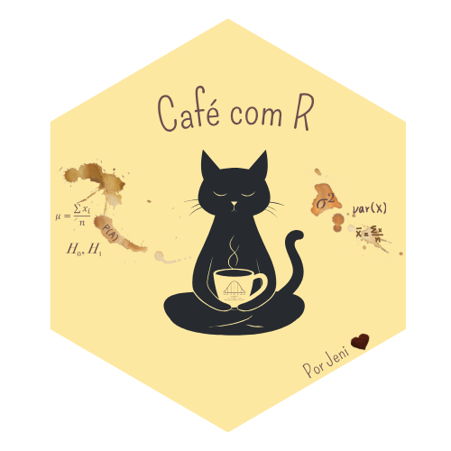

::::: {style="margin-bottom: 40px;"}
:::: texto-justificado
{fig-align="center"}

O Café com R nasceu de um hábito simples: parar um pouco, respirar e pensar nos dados com calma. Entre um gole de café e outro, surgem as ideias, aquelas que não cabem só em código, mas fazem sentido quando viram conversa.

Sempre acreditei que aprender estatística e R não precisa ser algo distante, cheio de termos difíceis e resultados sem alma. Aqui eu falo do que realmente me move: experimentar, errar, aprender e compartilhar.

Minha jornada foi bem assim, muitos acertos e erros! Mas hoje, sinto que estou 1% melhor a cada tentativa.

::: {.callout-tip style="border-left: 6px solid #6B4F4F;   background-color: #F7F2EE"}
## Dica

**Este espaço é pra gente se encontrar.**\

Quero que o **Café com R** seja um ponto de troca entre quem vive estatística, dados e muito mais, independente do nível técnico ou da área.\

Aqui cabe quem programa, quem pesquisa, quem ensina, quem está começando e quem ainda acha o R meio misterioso kkkkkkk.\

A ideia é assim: aprender junto, compartilhar o que funciona, rir dos erros e crescer com as experiências de cada um.\

Se tiver uma história, um script, um insight ou até uma dúvida que vale um café, esse lugar também é **seu**.🤎
:::

Não tem marketing, nem promessas de “domine o R em 7 dias”. Tem o que é real e funcionou para mim e outras pessoas que conheço: curiosidade, processo e aprendizado contínuo. Às vezes um pacote novo, às vezes uma reflexão sobre como a estatística muda o jeito que a gente enxerga o mundo e assim vai.

> Então puxa uma cadeira, pega seu café e fica à vontade. O **Café com R** é pra quem aprende no ritmo da vida, devagar, respirando constante no momento presente e com propósito.
::::
:::::

### ☕ Café com R

> Que cada **gole** desperte uma nova ideia.
>
> Que cada **script** abra uma nova conversa.
>
> Que o **Café com R**, se torne um ponto de encontro nosso!

```{=html}
<iframe 
  src="newsletter-widget.html" 
  width="100%" 
  height="800" 
  frameborder="0" 
  scrolling="no"
  style="border:none; display:block; margin: 0 auto;">
</iframe>
```
