::: {style="background:#EFEBE9; border-left: 4px solid #A1887F; padding: 16px 20px; border-radius: 4px; margin-bottom: 24px;"}
-   *Que cada **gole** desperte uma nova ideia.*

-   *Que cada **script** abra uma nova conversa.*

-   *Que o **Café com R** se torne um ponto de encontro nosso.*
:::

## Por que automação importa para quem trabalha com dados?

<br>

Pensa comigo: quanto tempo você gasta por semana em tarefas repetitivas?

{fig-align="center"}

<br>

Copiar dados de uma planilha para outra. Enviar o mesmo e-mail com pequenas variações. Baixar relatórios manualmente. Atualizar dashboards que poderiam se atualizar sozinhos.

Se você trabalha com dados, seja na agricultura, no agronegócio, na academia ou em **qualquer área que depende de análise**, uma parte considerável do seu tempo provavelmente vai para tarefas que um script ou um fluxo automatizado poderia executar sozinho.

> **Automação** não é assunto exclusivo de engenheiros de software ou de grandes empresas de tecnologia. É uma habilidade que todo profissional de dados pode e deveria desenvolver. **E as ferramentas para isso nunca foram tão acessíveis**.

## O que você vai construir neste tutorial

Este tutorial documenta o que eu construí e coloquei em produção para a newsletter do Café com R. É funcional, gratuito e, sobretudo, instrutivo sobre os fundamentos que você vai precisar para ir além deste caso de uso.

### **O que você vai ter ao final:**

-   Um widget de coleta de e-mails embedado no seu site Quarto
-   Um servidor n8n gratuito rodando 24h na nuvem via Railway
-   Salvamento automático de cada inscrito no Google Sheets
-   E-mail de agradecimento disparado automaticamente via Gmail

**Ferramentas utilizadas:**

| Ferramenta            | Função                                         |
|-----------------------|------------------------------------------------|
| **Quarto**            | Site onde o widget é embedado                  |
| **HTML + JavaScript** | Widget de coleta de e-mails                    |
| **Railway**           | Servidor em nuvem para hospedar o n8n          |
| **n8n**               | Orquestração visual (webhook + sheets + gmail) |
| **Google Sheets**     | Base de dados dos inscritos                    |
| **Gmail API**         | Envio do e-mail de boas-vindas                 |
| **Google Cloud**      | Credenciais OAuth para as APIs                 |

**Custo-atenção aqui:** O Railway oferece \$5 de crédito gratuito por mês. O n8n em uso leve consome entre \$1 e \$2 mensais. Para volumes pequenos, o sistema opera sem custo.

## O que é o n8n e por que ele existe

O **n8n** (pronuncia-se "nodemation") é uma plataforma de automação de fluxos de trabalho de código aberto. A ideia central é a mesma de ferramentas como **Zapier** ou **Make**: você conecta serviços diferentes sem precisar escrever código de integração manualmente.

{fig-align="center" width="505"}

A diferença fundamental é que o **n8n é self-hosted**, ou seja, você instala e executa no seu próprio servidor. Isso significa que não há limites de execuções impostos por planos pagos, nenhum dado trafega por servidores de terceiros sem seu controle, e o custo de operação é o custo da infraestrutura que você escolher.

A interface é visual, ou seja, você conecta **blocos chamados d**e **nós** como se estivesse desenhando um **fluxograma**. Cada **nó representa uma ação**, como receber dados via **webhook**, salvar em uma **planilha**, enviar um **e-mail**, fazer uma **requisição HTTP** ou executar uma **query SQL**.

::: {style="background:#EFEBE9; border-left: 4px solid #3E2723; padding: 16px 20px; border-radius: 4px; margin: 20px 0;"}
O n8n tem mais de 400 integrações nativas, incluindo Google Sheets, Gmail, Slack, WhatsApp, PostgreSQL, MySQL, GitHub, Notion, Airtable, OpenAI e dezenas de outras ferramentas.
:::

[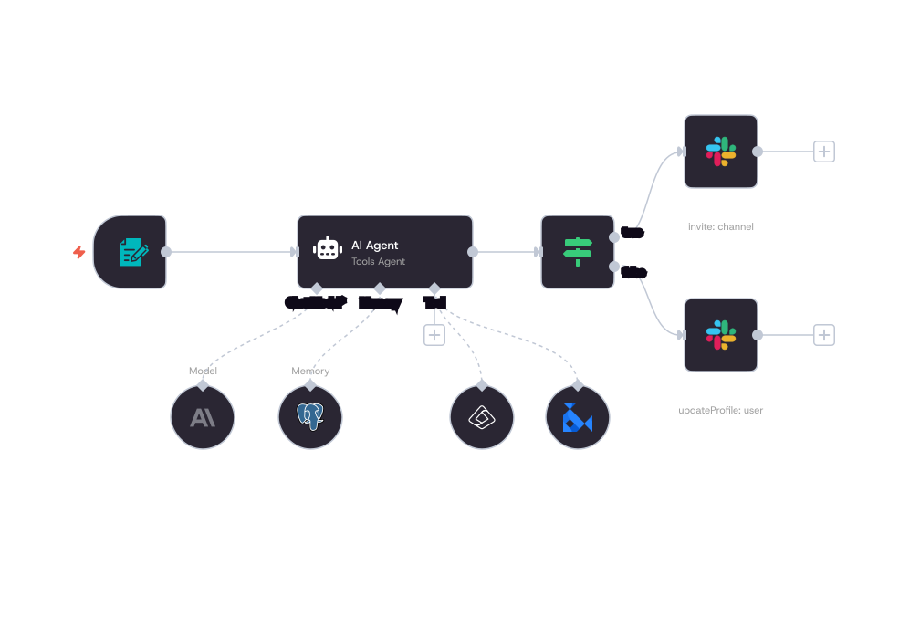{fig-align="center" width="616"}](https://n8n.io/)

### Por que não usar só o Google Sheets?

Essa é a pergunta certa, e o o professor Thiago Marques da Comunidade de Estatística perguntou num post.

{fig-align="center"}

**O que eu sei até aqui, explicando para vocês:**

Se o objetivo fosse apenas coletar e-mails, você poderia usar um Google Form que já salva direto numa planilha. Mas há três limitações estruturais nessa abordagem que o n8n resolve.

-   **Primeira: ausência de lógica entre etapas.** O Google Forms salva os dados, mas não dispara ações posteriores de forma flexível. Para enviar um e-mail de boas-vindas personalizado logo após o cadastro, você precisaria de **Google Apps Script**, o que significa escrever e manter código dentro de um ambiente limitado, sem versionamento, sem logs estruturados, sem interface de depuração.

-   **Segunda: acoplamento de ferramentas.** Quando você conecta dois serviços diretamente (Forms + Gmail via Script), qualquer mudança em um afeta o outro. **O n8n age como intermediário desacoplado, ou seja, ele recebe os dados, decide o que fazer com eles e pode ser reconfigurado sem tocar no formulário ou no destino.**

-   **Terceira: portabilidade.** O fluxo que você constrói no n8n para uma newsletter pode ser adaptado para coletar leads de um cliente, processar formulários de experimentos de campo ou disparar alertas a partir de leituras de sensor. A lógica é a mesma, só muda o conteúdo dos nós.

> Aqui busquei compreender mais para esse caso.

<br>

### O que você pode automatizar com o n8n

A lista é longa. Alguns exemplos para quem trabalha com dados e ciência aplicada:

| Cenário | Automação possível |
|----|----|
| Coleta de dados de campo | Formulário + Google Sheets + notificação por e-mail |
| Relatórios periódicos | Trigger agendado + query no banco + PDF gerado + envio por e-mail |
| Monitoramento de experimentos | Leitura de sensor + alerta no WhatsApp se valor fora do limite |
| Pipeline de dados | Arquivo CSV recebido + limpeza + inserção no banco + dashboard atualizado |
| Gestão de clientes | Novo contato no CRM + e-mail de boas-vindas + tarefa criada no Notion |
| Integração com APIs externas | Dados climáticos via API + análise no R + resultado salvo na planilha |

## `n8n` + `R`: uma combinação que faz sentido

**Aqui fica interessante para quem usa `R` no dia a dia.**

O n8n possui um nó chamado **Execute Command**, que permite executar scripts diretamente no servidor onde ele está hospedado. **Isso significa que você pode acionar scripts R como parte de um fluxo automatizado.**

<br>

**Imagine este cenário:**

```         
Novo arquivo CSV chega via e-mail
         |
         v
n8n salva o arquivo no servidor
         |
         v
n8n executa: Rscript analise.R --input dados.csv
         |
         v
Script R faz limpeza, análise e gera relatório PDF
         |
         v
n8n envia o PDF por e-mail para o cliente
```

<br>

**Ou ainda, usando a integração com APIs HTTP:**

```         
Trigger agendado (todo dia às 7h)
         |
         v
n8n faz requisição para uma API REST em R (Plumber)
         |
         v
API R executa modelo preditivo com dados atualizados
         |
         v
Resultado é salvo no Google Sheets
         |
         v
Notificação automática no Slack ou WhatsApp
```

<br>

::: callout-tip
## R + Plumber + n8n

O pacote **`{plumber}`** transforma funções R em APIs REST com poucas linhas de código. Combinado com o **`n8n`**, você consegue criar pipelines completas onde o R executa a análise pesada e o n8n cuida de toda a orquestração, por exemplo: **receber dados, acionar o modelo, distribuir os resultados.**

Isso é o que muitos chamam de **MLOps leve**: colocar modelos e análises em produção sem precisar de infraestrutura complexa.
:::

Automatizar pipelines significa **menos tempo operacional** e mais tempo para interpretar resultados, menos erro humano em processos repetitivos de coleta e transformação, mais escalabilidade, pois o mesmo fluxo que processa 10 relatórios processa 100, e esses se geram automaticamente para clientes, sem retrabalho.

> **Não se trata de substituir o profissional. Trata-se de liberar ele para pensar, que é onde o valor está. (Aqui tem um contexto muito maior, não é papo para hoje.)**

<br>

## Visão geral do fluxo

```         
Visitante preenche o formulário no site
              |
              v
   Widget HTML envia POST para o webhook
              |
              v
       n8n recebe os dados
         /              \
        v                v
Respond to Webhook    Google Sheets
(responde ao          (salva o contato)
 navegador)                |
                           v
                         Gmail
                   (envia boas-vindas)
```

Os dados trafegados são: `name`, `email`, `source` e `ts` (timestamp ISO 8601).

<br>

## Parte 1: Subir o n8n no Railway

### Por que o Railway

O n8n pode rodar localmente no seu computador, mas nesse caso o webhook só funciona enquanto o computador estiver ligado. Para funcionar 24h com uma URL pública acessível pelo site, ele precisa estar em um servidor na nuvem.

O Railway é a opção mais direta: você sobe o n8n em minutos a partir de um template pronto, sem precisar configurar nada manualmente no servidor.

### Criar conta no Railway

1.  Acesse [railway.app](https://railway.app) e crie uma conta usando login com GitHub. Se não tiver conta no GitHub, crie primeiro em [github.com](https://github.com).

2.  Após criar a conta, você recebe **30 dias e \$5,00 de crédito gratuito**. Esse valor é suficiente para manter o n8n rodando por 2 a 5 meses em uso leve de newsletter.

<br>

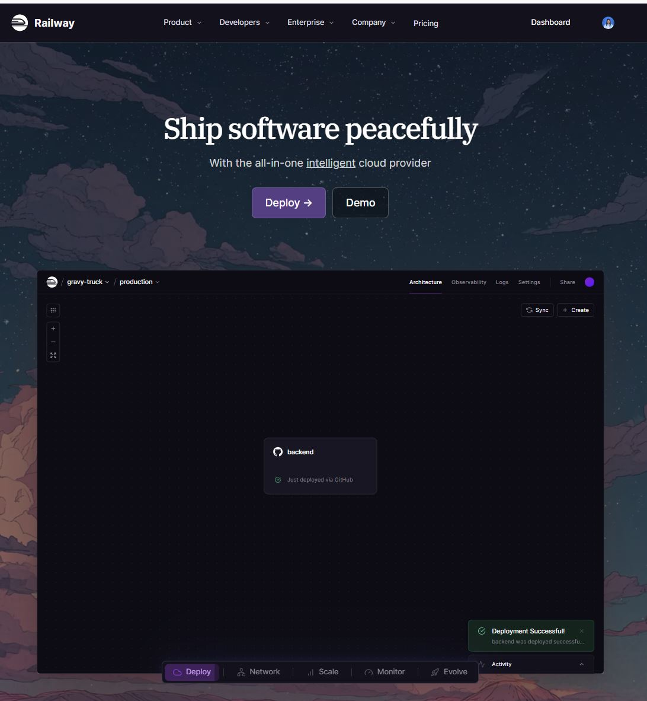{fig-align="center" width="590"}

<br>

### Selecionar o template correto

No painel do Railway, clique em **New Project** e depois em **Deploy a Template**. Na busca, digite `n8n`.

<br>

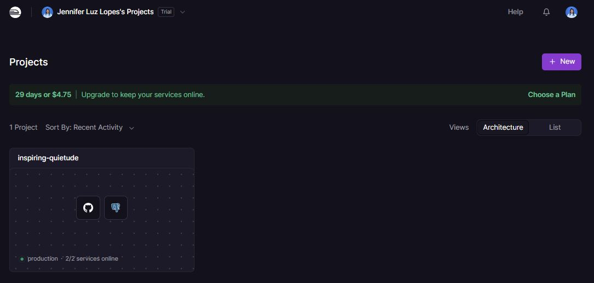{fig-align="center" width="640"}

Vão aparecer mais de um resultado. Selecione o template chamado simplesmente **n8n**, aquele com **1 ou 2 serviços** (n8n + Postgres).

<br>

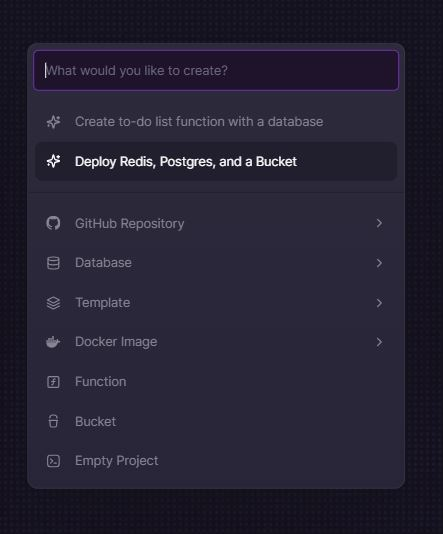{fig-align="center"}

<br>

::: callout-warning
## Cuidado com o template errado

Existe um template chamado **"N8N With Workers"** que instala 4 serviços (Primary, Worker, Redis, Postgres). Ele funciona, mas consome os créditos significativamente mais rápido. Para uma newsletter, o template leve é suficiente.
:::

Clique em **Deploy Now** e aguarde cerca de 3 minutos enquanto o Railway provisiona o ambiente.

<br>

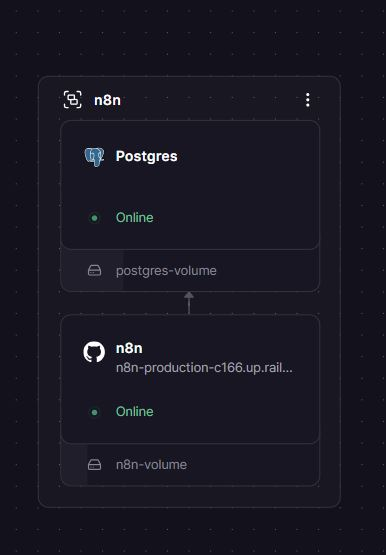{fig-align="center"}

<br>

### Gerar a URL pública

Após o deploy, acesse o projeto criado e clique no serviço do n8n. Vá na aba **Settings** \> **Networking** e clique em **Generate Domain**.

<br>

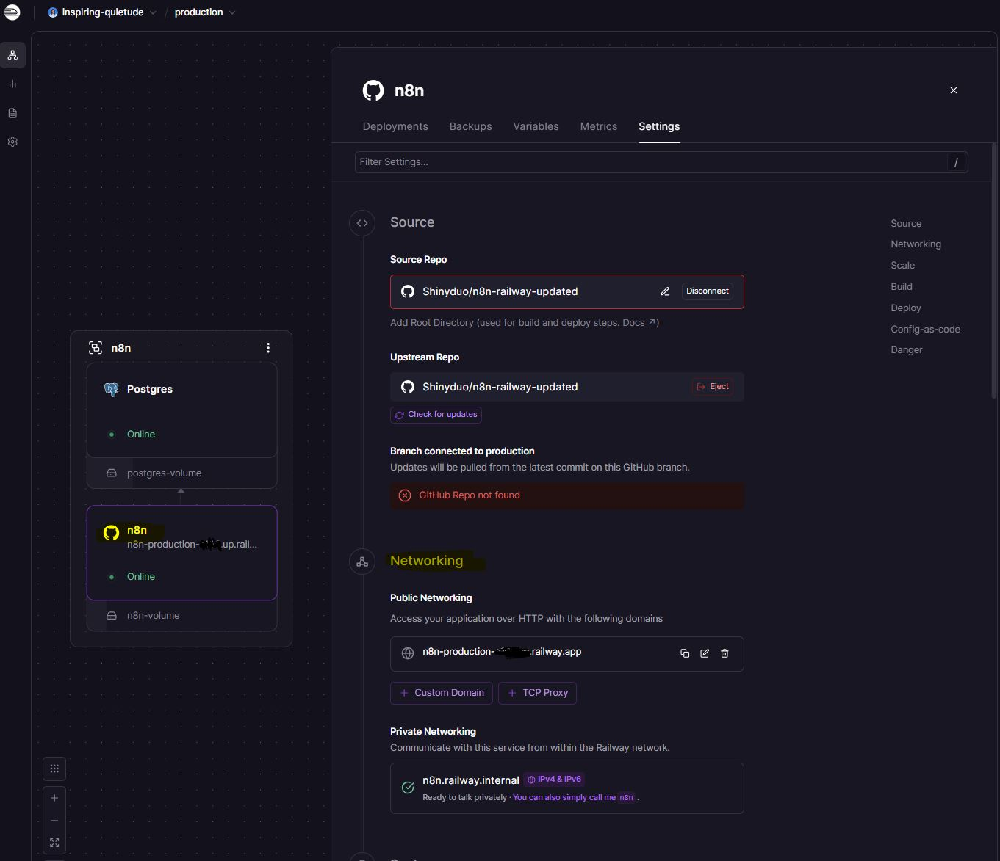{fig-align="center" width="557"}

<br>

**O Railway vai gerar uma URL no formato:**

```         
https://n8n-production-xxxx.up.railway.app
```

**Guarde essa URL, pois ela será usada em vários momentos ao longo da configuração.**

### Criar a conta no n8n

Acesse a URL gerada no navegador. Na primeira vez, o n8n solicita a criação de uma conta de administrador. **Preencha:**

-   **Email:** seu e-mail
-   **First Name / Last Name:** seu nome
-   **Password:** senha com no mínimo 8 caracteres, 1 número e 1 letra maiúscula

::: callout-tip
**Anote a senha em um gerenciador de senhas. Em um servidor self-hosted, não há recuperação automática.**
:::

<br>

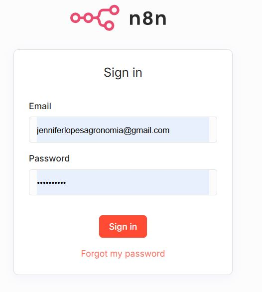{fig-align="center"}

<br>

Após o login, o n8n exibe um questionário de personalização, que você pode pular clicando em **Comece agora**.

Em seguida, ele oferece uma **licença gratuita** com recursos extras de depuração e histórico de execuções. Vale aceitar: basta informar o e-mail e confirmar. Os recursos ficam disponíveis permanentemente.

## Parte 2: Criar o fluxo no n8n

### Conceito: o que é um webhook

-   Um **webhook** é um endpoint HTTP que fica aguardando requisições externas. Ao contrário de uma API onde você faz uma pergunta e espera uma resposta, no webhook você registra uma URL e qualquer sistema que conhece essa URL pode enviar dados para ela a qualquer momento.

-   No nosso fluxo, o formulário HTML do site envia um `POST` para o webhook do n8n assim que o visitante clica em "Inscrever". O n8n recebe esse `POST`, extrai os dados do corpo da requisição e os processa.

## Criar o fluxo no n8n

<br>

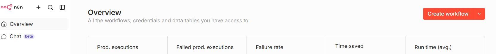{fig-align="center"}

<br>

### Adicionar o nó Webhook

Dentro do n8n, clique em **New Workflow**. Clique no **+** e adicione o nó **Webhook**.

<br>

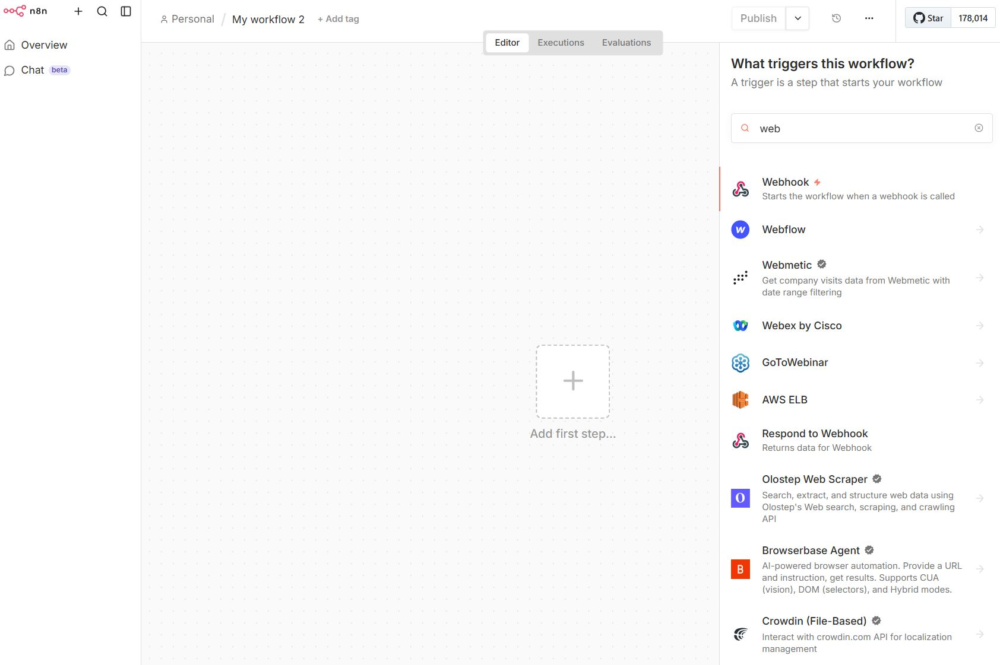{fig-align="center" width="564"}

<br>

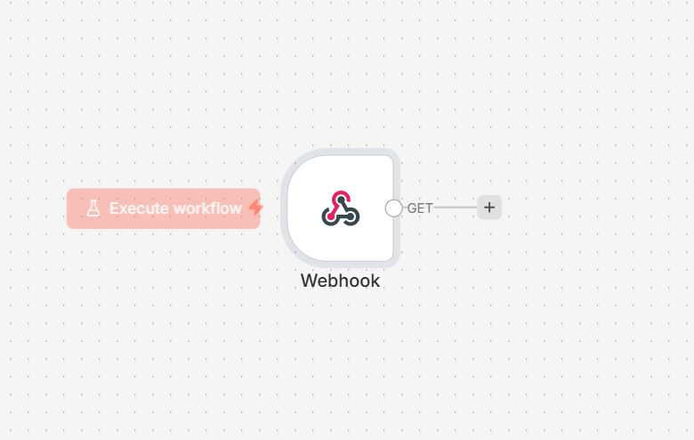{fig-align="center" width="572"}

<br>

**Na configuração do nó:**

-   **HTTP Method:** POST
-   **Path:** pode deixar o gerado automaticamente
-   **Respond:** selecione **Using 'Respond to Webhook' Node**

Após configurar, clique em **Production URL** e copie a URL exibida. Ela tem o formato:

```         
https://n8n-production-xxxx.up.railway.app/webhook/[identificador]
```

Essa URL será colada no formulário HTML mais adiante.

<br>

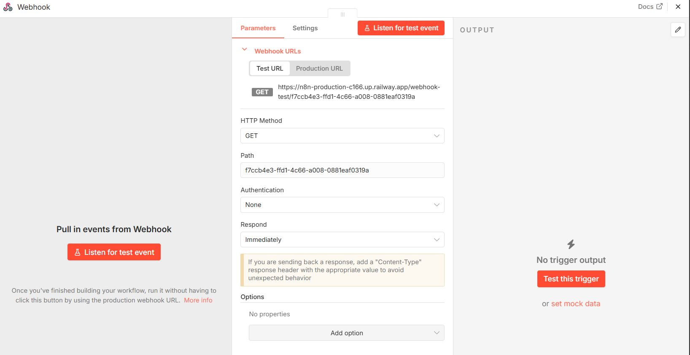{fig-align="center" width="577"}

<br>

### Adicionar o nó Respond to Webhook

::: callout-important
## Este nó é obrigatório

Sem ele, o navegador bloqueia a requisição do formulário por política de CORS. O botão de envio fica girando indefinidamente e nenhum dado chega ao n8n.
:::

**O que é CORS e por que ele importa aqui:**

Quando um formulário em um site tenta enviar dados para outro domínio, no caso o Railway, o navegador executa uma verificação de segurança chamada *preflight*. Antes de enviar os dados de fato, ele envia uma requisição `OPTIONS` perguntando ao servidor se aquele domínio está autorizado a fazer a requisição. O servidor precisa responder com cabeçalhos HTTP específicos autorizando a origem. O nó **Respond to Webhook** é o mecanismo pelo qual o n8n responde a essa verificação.

Clique no **+** saindo **diretamente do nó Webhook** e adicione o nó **Respond to Webhook**.

<br>

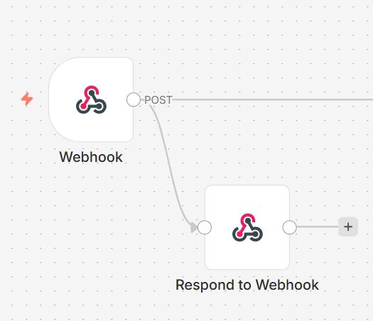{fig-align="center"}

<br>

**Configure assim:**

-   **Respond With:** Text
-   **Response Body:** `OK`
-   Em **Options**, adicione **Response Headers** com três entradas:

| Name                           | Value           |
|--------------------------------|-----------------|
| `Access-Control-Allow-Origin`  | `*`             |
| `Access-Control-Allow-Methods` | `POST, OPTIONS` |
| `Access-Control-Allow-Headers` | `Content-Type`  |

<br>

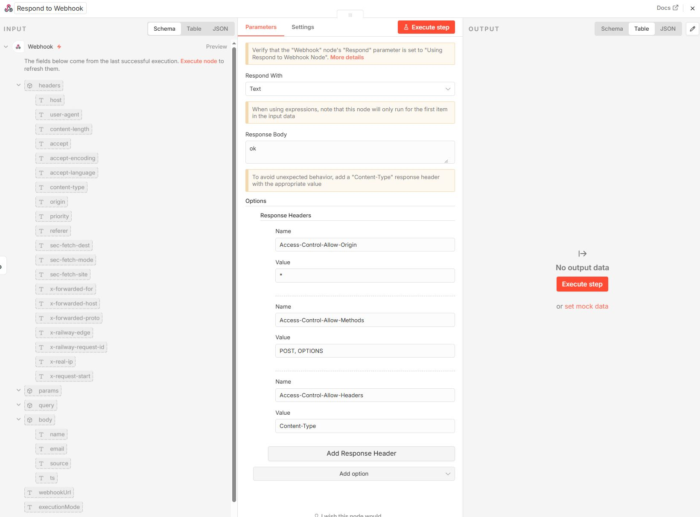{fig-align="center" width="654"}

<br>

**Atenção na topologia da conexão:** o nó Respond to Webhook deve estar conectado diretamente ao Webhook, em paralelo com o Google Sheets, e não em sequência após ele. O Webhook deve ter duas saídas independentes:

```         
Webhook ──► Respond to Webhook
        └──► Append row in sheet ──► Send a message
```

::: callout-warning
## Erro de conexão frequente

Conectar o Respond to Webhook após o Google Sheets, em sequência, faz com que o fluxo não funcione corretamente. O navegador precisa receber a resposta CORS antes do processamento dos dados. Verifique sempre se o Webhook tem duas saídas independentes.
:::

### Configurar o Google Sheets

{fig-align="center" width="406"}

#### Preparar a planilha

**Antes de configurar o nó, crie uma planilha no Google Sheets com as seguintes colunas na primeira linha:**

```         
Nome | Email | Data
```

Os nomes das colunas precisam ser exatamente esses, pois o n8n mapeia os campos pelo nome.

#### Criar as credenciais OAuth no Google Cloud

O n8n acessa o Google Sheets via OAuth 2.0. **OAuth 2.0** é um protocolo de autorização que permite que uma aplicação acesse recursos em nome de um usuário sem que a aplicação precise conhecer a senha desse usuário. Em vez disso, o usuário autoriza a aplicação no próprio painel do Google, e o Google emite um token de acesso temporário.

Para configurar isso, é preciso criar uma credencial no Google Cloud Console.

**Passo 1: Criar o projeto**

1.  Acesse [console.cloud.google.com](https://console.cloud.google.com)
2.  Clique em **Selecionar projeto** \> **Novo projeto**
3.  Nome sugerido: `cafe-com-r`, clique em **Criar**

<br>

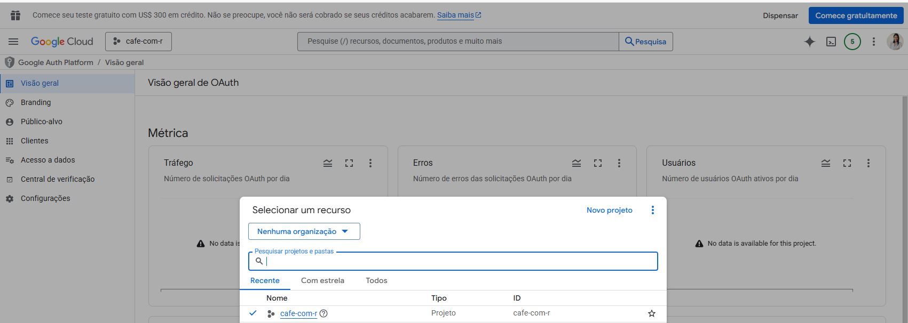{fig-align="center"}

<br>

**Passo 2: Ativar as APIs**

1.  Vá em **APIs e serviços** \> **Biblioteca**
2.  Busque e ative: **Google Sheets API**
3.  Busque e ative: **Google Drive API**
4.  Busque e ative: **Gmail API**

<br>

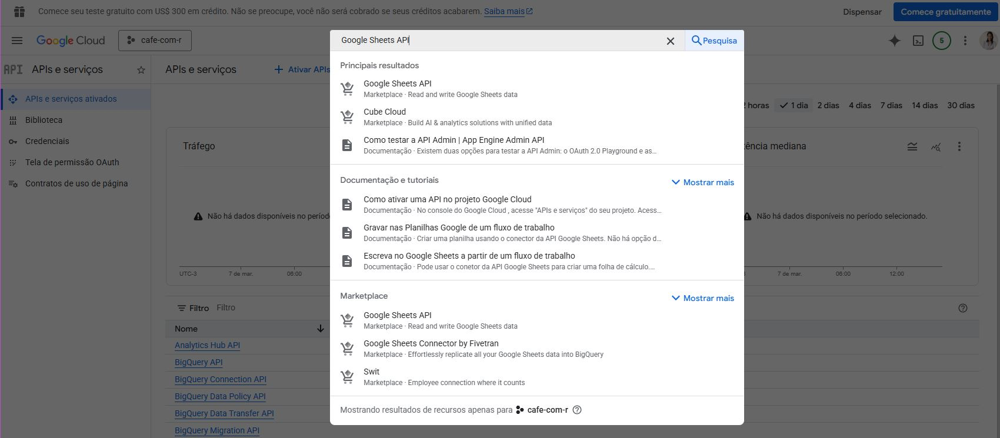{fig-align="center"}

<br>

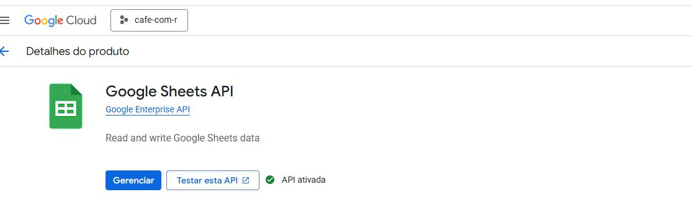{fig-align="center"}

<br>

::: callout-warning
## Erro OAuth 414

Se as APIs não estiverem ativadas antes de tentar conectar, o n8n vai retornar um erro 414 (URI too long) ao tentar gerar a URL de autorização. Ative as três APIs antes de continuar.
:::

**Passo 3: Configurar a tela de consentimento**

1.  Vá em **APIs e serviços** \> **Google Auth Platform** (ou Tela de consentimento OAuth)
2.  Configure com tipo **Externo**
3.  Preencha apenas o nome do app, pois os outros campos são opcionais para uso pessoal

**Passo 4: Criar a credencial OAuth**

1.  Vá em **Clientes** \> **Criar um cliente OAuth**
2.  Tipo de aplicativo: **Aplicativo da Web**
3.  Em **Origens JavaScript autorizadas**, adicione apenas o domínio base:

```         
https://n8n-production-xxxx.up.railway.app
```

4.  Em **URIs de redirecionamento autorizados**, adicione a URL completa:

```         
https://n8n-production-xxxx.up.railway.app/rest/oauth2-credential/callback
```

5.  Clique em **Criar** e copie o **ID do cliente** e o **Segredo do cliente**

<br>

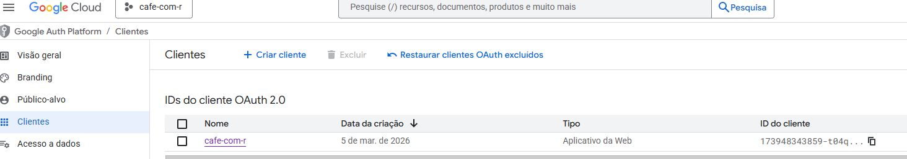{fig-align="center"}

<br>

::: callout-important
## Dois campos distintos: erro comum

**Origens JavaScript autorizadas** aceita apenas o domínio base, sem caminho. Colocar a URL completa nesse campo gera um erro de "Origem inválida".

**URIs de redirecionamento autorizados** é onde vai a URL completa com `/rest/oauth2-credential/callback`.

São dois campos distintos na mesma tela. Confundi esses campos na primeira tentativa e fiquei meia hora tentando entender por que a autorização falhava.
:::

**Passo 5: Adicionar usuário de teste**

Como o app está em modo de desenvolvimento, apenas e-mails cadastrados na lista de testadores conseguem autenticar.

Vá em **Google Auth Platform** \> **Público-alvo** \> **Usuários de teste** e adicione o seu e-mail.

<br>

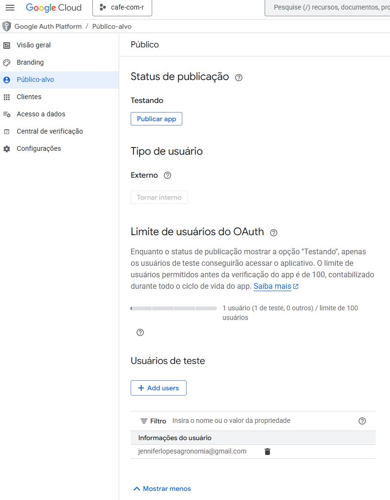{fig-align="center" width="571"}

<br>

::: callout-warning
## Erro 403: access_denied

Se aparecer a mensagem "Acesso bloqueado: o app não concluiu o processo de verificação do Google", seu e-mail não está na lista de testadores. Adicione-o conforme descrito acima e tente novamente.
:::

#### Conectar o Google Sheets no n8n

No nó **Google Sheets**, clique em **Select Credential** \> **Add new credential**. Cole o ID do cliente e o segredo nos campos correspondentes e clique em **Sign in with Google**.

Após conectar, configure o nó:

-   **Operation:** Append Row
-   **Document:** selecione a planilha criada
-   **Sheet:** selecione a aba (ex: Página1)

Nos campos de mapeamento, ative **Expression** em cada campo e use:

| Campo na planilha | Expression               |
|-------------------|--------------------------|
| Nome              | `{{ $json.body.name }}`  |
| Email             | `{{ $json.body.email }}` |
| Data              | `{{ $json.body.ts }}`    |

**Por que `$json.body.name` e não `$json.name`?**

Quando o formulário envia um `POST` com corpo JSON, o n8n estrutura os dados recebidos assim:

``` json
{
  "body": {
    "name": "Jennifer",
    "email": "jennifer@exemplo.com",
    "source": "newsletter-widget",
    "ts": "2025-06-01T14:32:00.000Z"
  },
  "headers": { ... },
  "params": { ... }
}
```

O conteúdo que você enviou no corpo da requisição fica dentro de `.body`. Usar `$json.name` diretamente retorna `undefined` e a célula fica vazia. Fiz esse erro na primeira configuração, e você não precisa repetir.

<br>

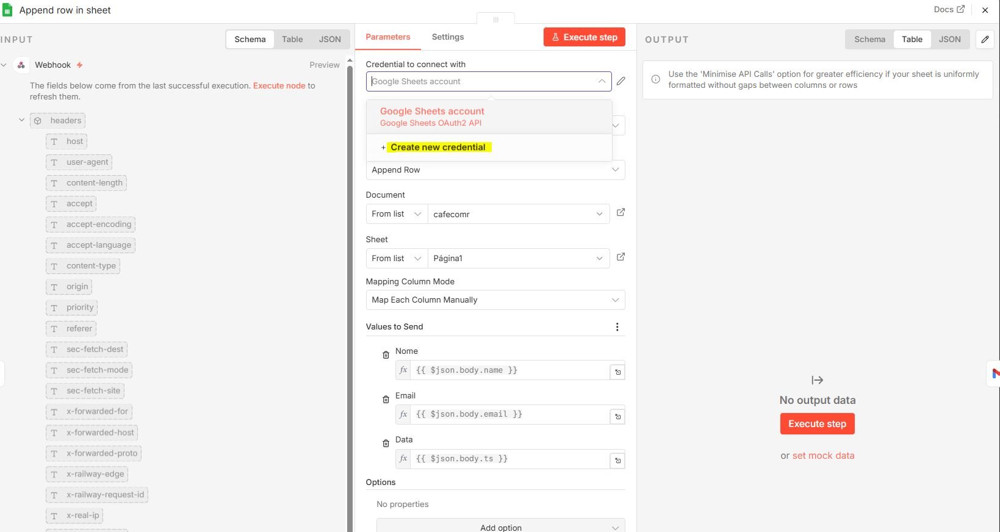{fig-align="center" width="660"}

<br>

### Configurar o Gmail

Adicione o nó **Gmail** após o Google Sheets. Selecione a ação **Send a message**.

<br>

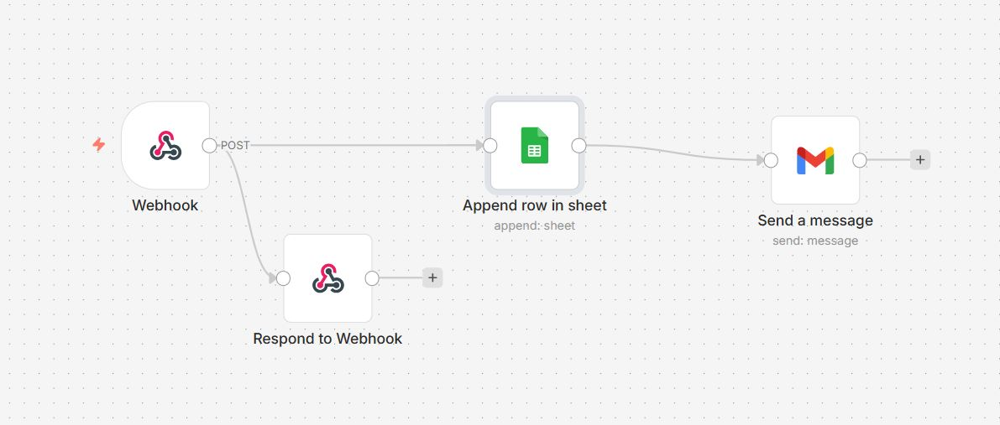{fig-align="center"}

<br>

Crie uma nova credencial usando o **mesmo ID e segredo** criados para o Google Sheets. A Gmail API já foi ativada anteriormente, então a conexão deve funcionar diretamente.

**Preencha os campos:**

**To** (ative Expression):

```         
{{ $('Webhook').item.json.body.email }}
```

**Subject** (ative Expression):

```         
Bem-vinda(o) ao Cafe com R, {{ $('Webhook').item.json.body.name }}!
```

**Email Type:** HTML

**Message** (modo Fixed, não precisa de Expression):

``` html
<div style="font-family:sans-serif;max-width:500px;margin:0 auto;
            padding:32px;background:#FDFAF4;border:1px solid #A1887F;">

  <h2 style="font-family:Georgia,serif;color:#3E2723;">
    Ola, {{ $('Webhook').item.json.body.name }}!
  </h2>

  <p style="color:#5D4037;line-height:1.7;">
    Que alegria ter voce no <strong>Cafe com R</strong>!
  </p>

  <div style="border-left:3px solid #A1887F;padding:12px 20px;
              margin:24px 0;background:#EFEBE9;">
    <p style="color:#5D4037;font-style:italic;line-height:1.8;margin:0;">
      Que cada <strong>gole</strong> desperte uma nova ideia.<br>
      Que cada <strong>script</strong> abra uma nova conversa.<br>
      Que o <strong>Cafe com R</strong> se torne um ponto de encontro nosso.
    </p>
  </div>

  <div style="text-align:center;margin:24px 0;">
    <a href="https://jenniferlopes.quarto.pub/portifolio"
       style="background:#3E2723;color:#F5F5DC;text-decoration:none;
              padding:12px 28px;border-radius:4px;font-size:13px;
              letter-spacing:1px;font-weight:500;">
      Visitar o Cafe com R
    </a>
  </div>

  <p style="color:#5D4037;line-height:1.7;">
    Prepare o cafe e ate a proxima edicao.
  </p>

  <hr style="border:none;border-top:1px solid #EFEBE9;margin:24px 0;">

  <p style="color:#A1887F;font-size:12px;">
    Com carinho, <strong>Jeni</strong><br>
    <a href="https://jenniferlopes.quarto.pub/portifolio"
       style="color:#2E7D32;">Cafe com R</a>
  </p>
</div>
```

Em **Options**, adicione **Sender Name** e preencha com:

```         
Jeni | Cafe com R
```

<br>

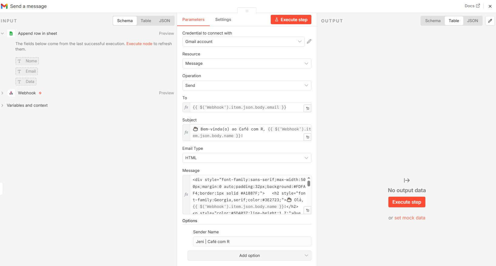{fig-align="center"}

<br>

### Publicar o fluxo

Clique em **Save** (ou Ctrl+S) e depois em **Publish** no canto superior direito. O fluxo entra em produção imediatamente e começa a receber requisições na URL do webhook.

## Parte 3: Formulário HTML

### Estrutura do formulário

O formulário é um arquivo HTML autônomo (`newsletter-widget.html`) embedado no site Quarto via iframe. Ele coleta nome e e-mail, envia os dados para o webhook via `fetch` e exibe uma confirmação de sucesso.

O ponto central no código é a variável `WEBHOOK_URL`:

``` javascript
const WEBHOOK_URL = "https://n8n-production-xxxx.up.railway.app/webhook/[id]";
```

Substitua pelo valor copiado na configuração do nó Webhook. Use a **Production URL**, não a Test URL.

A função de envio:

``` javascript
async function handleSubmit() {
  const name  = document.getElementById("name").value.trim();
  const email = document.getElementById("email").value.trim();

  if (!email || !email.includes("@")) {
    document.getElementById("email").style.borderColor = "#b5451b";
    document.getElementById("email").focus();
    return;
  }

  const btn = document.getElementById("submit-btn");
  btn.classList.add("loading");
  btn.disabled = true;

  try {
    await fetch(WEBHOOK_URL, {
      method: "POST",
      headers: { "Content-Type": "application/json" },
      body: JSON.stringify({
        name,
        email,
        source: "newsletter-widget",
        ts: new Date().toISOString()
      })
    });
  } catch (e) {
    console.warn("Webhook error:", e);
  }

  await new Promise(r => setTimeout(r, 900));
  btn.classList.remove("loading");
  document.getElementById("success").classList.add("show");
}
```

**Por que `new Date().toISOString()`?**

O método `toISOString()` retorna a data e hora no formato ISO 8601, que é um padrão internacional para representação de datas e horas: `2025-06-01T14:32:00.000Z`. Usar esse formato em vez de strings como "01/06/2025 14:32" garante que os dados possam ser ordenados, filtrados e parseados corretamente em qualquer sistema, inclusive em queries SQL ou em manipulações de data no R com `lubridate`.

::: callout-warning
## Nao use localStorage no formulário

Se o formulário for embedado via iframe, o navegador pode carregar o HTML em contexto `data:` URL. Nesse caso, o acesso ao `localStorage` é bloqueado com o erro:

```         
SecurityError: Failed to read the 'localStorage' property from 'Window':
Storage is disabled inside 'data:' URLs.
```

O botão trava e nenhum dado é enviado. Remova qualquer uso de `localStorage` do código. Os dados já ficam persistidos no Google Sheets via webhook.
:::

### Embeder no Quarto

Salve o arquivo `newsletter-widget.html` na mesma pasta do arquivo `.qmd`. No `.qmd`, adicione o bloco abaixo onde quiser que o formulário apareça:

```` markdown
```{=html}
<iframe
  src="newsletter-widget.html"
  width="100%"
  height="600"
  frameborder="0"
  scrolling="no"
  style="border:none; display:block; margin: 0 auto;">
</iframe>
```
````

::: callout-note
O iframe só renderiza corretamente quando o site está sendo servido via `quarto preview` ou após publicação. O painel de preview interno do RStudio pode não exibir o widget, e esse é o comportamento esperado.
:::

## Parte 4: Erros que encontrei e como resolvi

### Formulário trava no estado de carregamento

-   **Causa:** O navegador está bloqueando a requisição por política de CORS.

-   **Como confirmar:** Abra o site, pressione **F12** \> aba **Console** \> tente enviar o formulário. Procure erros vermelhos com:

```         
Access to fetch... has been blocked by CORS policy
```

-   **Solucao:** Adicionar o nó **Respond to Webhook** com os cabeçalhos CORS corretos, conforme descrito na Parte 2. Verifique também se o workflow está publicado (botão **Publish** ativo).

### Erro `localStorage` no console

-   **Causa:** O formulário está sendo carregado em contexto `data:` URL.

-   **Solucao:** Remover todo uso de `localStorage` do código. Os dados são persistidos pelo webhook no Google Sheets.

### Erro 403: access_denied (Google)

-   **Causa:** O app está em modo de teste e o e-mail usado não está na lista de usuários autorizados.

-   **Solucao:** No Google Cloud Console, vá em **Google Auth Platform** \> **Público-alvo** \> **Usuários de teste** \> adicione o seu e-mail \> salve. Depois tente conectar novamente no n8n.

### Erro OAuth 414 ao clicar em "Sign in with Google"

-   **Causa:** As APIs do Google não estavam ativadas antes de tentar conectar.

-   **Solucao:** Ative **Google Sheets API**, **Google Drive API** e **Gmail API** no Google Cloud Console antes de criar a credencial OAuth.

### Erro de "Origem inválida" ao cadastrar URL no Google Cloud

-   **Causa:** A URL completa foi colada no campo **Origens JavaScript autorizadas**.

-   **Solucao:** São dois campos distintos:

-   **Origens JavaScript autorizadas**, apenas o domínio base:

    ```         
    https://n8n-production-xxxx.up.railway.app
    ```

-   **URIs de redirecionamento autorizados**, URL completa:

    ```         
    https://n8n-production-xxxx.up.railway.app/rest/oauth2-credential/callback
    ```

### Dados não aparecem na planilha

-   **Causa 1:** O fluxo não está publicado. O botão **Publish** precisa estar ativo no n8n.

-   **Causa 2:** O mapeamento dos campos usa `$json.name` em vez de `$json.body.name`. Como o webhook recebe os dados no corpo da requisição POST, o caminho correto é sempre `body.name`, `body.email` e `body.ts`.

-   **Causa 3:** O formulário está usando a **Test URL** do webhook em vez da **Production URL**. Na configuração do nó Webhook, clique em **Production URL** e copie essa URL.

### Template errado no Railway

-   **Causa:** Foi selecionado o template **N8N With Workers** (4 serviços) em vez do template simples.

-   **Solucao:** Delete o projeto no Railway e crie novamente usando o template com **1 ou 2 serviços**.

## Resumo das etapas

1.  Criar conta no Railway e subir o template simples do n8n (1 ou 2 serviços)
2.  Gerar o domínio público e criar a conta de administrador no n8n
3.  Criar o fluxo com os nós: **Webhook** \> **Respond to Webhook** (paralelo) \> **Google Sheets** \> **Gmail**
4.  Criar projeto no Google Cloud e ativar as APIs: Sheets, Drive e Gmail
5.  Criar credencial OAuth e adicionar o e-mail como usuário de teste
6.  Conectar Google Sheets e Gmail no n8n usando as credenciais OAuth
7.  Mapear os campos: `$json.body.name`, `$json.body.email`, `$json.body.ts`
8.  Colar a **Production URL** do webhook no formulário HTML
9.  Remover uso de `localStorage` do formulário
10. Publicar o fluxo no n8n e publicar o site Quarto

**Uma vez configurado, o sistema não requer intervenção manual. Cada nova inscrição é registrada na planilha e dispara o e-mail de boas-vindas automaticamente.**

::: {style="background:#EFEBE9; border:1px solid #A1887F; padding:20px 24px; border-radius:4px; margin-top:32px; text-align:center;"}
Na semana que vem, vou complementar este material. Vou ensinar formas de envio e automação através do pacote **Blastula** e muito mais!!!

**AGUARDEM QUE SEMANA QUE VEM TEM MAIS!**
:::

::: {style="background:#EFEBE9; border:1px solid #A1887F; padding:20px 24px; border-radius:4px; margin-top:32px; text-align:center;"}
**Gostou do tutorial?** Assine o Café com R e receba conteúdo de R e Ciência de Dados toda semana.

[jenniferlopes.quarto.pub/portifolio](https://jenniferlopes.quarto.pub/portifolio)
:::
